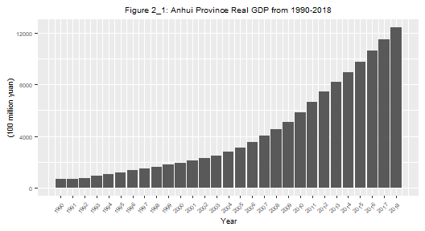

# 1 Abstract

Today, more and more countries and regions are facing the combined
impact of energy shortage, industrial transformation and economic
stagnation. Under this background, some emerging economic phenomena are
worthy of study, and by revealing their internal relations, we can
provide guidance and suggestions for future development that are in line
with local conditions. In this paper, the author focuses on analyzing
the deviation of GDP growth rate from the growth rate of electricity
usage in Anhui Province, China (the author’s hometown). Combined with
the data of electricity consumption and total output value, the author
sets up a regression model and uses the *Logarithmic Mean Divisia Index
Method (LMDI)* method to analyze the reasons for the deviation from
three perspectives: industrial structure, electricity consumption
efficiency, and overall economic situation.

Anhui, an inland province in China. Due to its large reserves of coal
and ore, it has several industrial cities, mainly engaged in thermal
power generation and various metal manufacturing. With the reduction of
mineral reserves, the previous internal cycle of high-yield electricity
(coal power generation) and high power consumption (metal manufacturing)
is no longer stable and sustainable. Electricity supply is insufficient,
and the industrial structure is also changing. Since 2012, the economic
growth rate of Anhui Province has slowed down, and at the same time,
electricity consumption has begun to deviate from the GDP growth rate.
This article focuses on the causes of deviations, their influences, and
future recommendations.

First, I analyzed the data characteristics of industrial output value
and electricity consumption in Anhui Province from 1995 to 2018. By
comparing the real GDP of various industries, it is confirmed that the
industrial structure has undergone two-stage changes: the dominance of
the secondary industry (2002-2012), and the accelerated development of
the tertiary industry (2012-2018). By comparing the growth rates of GDP
and electricity consumption, it is confirmed that the two are closely
related to each other before 2012. Since 2012, the growth rate of GDP
has declined, deviating from electricity consumption.

Second, by introducing concepts such as electricity consumption per unit
of output value, I deduce the mechanism that affects the growth rate of
electricity consumption: GDP growth rate and growth rate of electricity
consumption per unit output value jointly determine the growth rate of
electricity consumption, and electricity consumption per unit output
value is affected by the industrial structure.

Third, through the ADF test, this paper proves that the growth rate of
electricity consumption has a co-integration relationship with the
growth rate of GDP, electricity consumption per unit of output value,
and industrial structure. A regression model was constructed based on
time series data, and the results confirmed that: for the growth rate of
electricity consumption, the growth rate of GDP is the main influence,
followed by the electricity consumption per unit output value of the
secondary industry. The proportion of the secondary and tertiary
industries in the whole industry have a similar impact.

Fourth, I used *Logarithmic Mean Divisia Index Method (LMDI)* proposed
by Ang to decompose the electricity consumption growth in Anhui Province
into output effects, structure effects, and intensity effects, measure
the impact of growth rate of output value, industrial structure change
and electricity consumption efficiency respectively on electricity
consumption. The results show that the output effect is the main source
of electricity consumption, and the intensity effect is the main source
of electricity saving. The secondary industry occupies a dominant
position in the above three effects, and the primary industry is not
prominent due to its small output value. The main reason for the
deviation is that after the GDP growth rate declined, the output value
of the secondary industry declined the most. At the same time, its
electricity consumption efficiency is improved, and the growth rate of
electricity consumption decreases faster. When the growth rate of the
secondary industry reaches the end, its output effect recovers and its
electricity consumption efficiency decreases. The electricity
consumption efficiency of the tertiary industry decreases and its output
value increases, which makes the overall electricity consumption
increase and the growth rate exceeds the GDP.

Fifth, summarize the problems found in this paper. After 2012, the
proportion of the tertiary industry in GDP has increased, and the
industrial structure is changing. The structure effect of the tertiary
industry does not continue to save electricity, but its intensity effect
wastes more due to its low electricity efficiency. The electricity
efficiency of the secondary industry has slowed down due to
technological progress and other reasons, and cannot be improved as
before, but its output effect still requires a large amount of
electricity. In the short term, relevant institutions should pay
attention to the technological progress of the tertiary industry and
improve its electricity efficiency. In the long run, the speed of change
in the industrial structure requires attention.

# 2 Chapter1 Research background and the current research status

## 2.1 (I) Background

Since the last century, the relationship between energy consumption and
industrial development has become extremely close. For some
industrialized regions in China, the most important energy source is
electricity. Because of its connection with industrial production,
electricity use also has an important relationship with economic
development. Previously, experts and scholars from various countries
have conducted long-term and in-depth studies on the correlation between
power consumption and economic growth. Hwang(1984)\[1\],
Gum(1992)\[2\] and Mashi(1997)\[3\] were among the
earliest scholars to study this subject. They used Granger Causality
Test(1969)\[4\] to test the level value of the time series
according to the sample data of different countries, or the same series
of the same country but different sample intervals, got different
conclusions. With the deepening of research, the research methods
between power consumption and economy are constantly improved, mainly
econometric analysis and decomposition analysis.

## 2.2 (II) Analysis of Econometric Methods

In recent years, more and more various econometric methods have been
widely used in related research. Soytas(2003)\[5\] used 16
countries as the research object to analyze the relationship between
energy consumption and economic growth. The results of cointegration
analysis showed that the two-time series values in all countries are
first-order single-integration, and there is a co-integration
relationship. In addition to economic growth, more and more factors have
been proved to be explanatory variables of electricity growth.
Lariviere(1999)\[6\] found that population, temperature, and
other factors have important influences on the electricity consumption
of major cities in Canada. Steenhof(2006)\[7\] analyzed the
power consumption of China’s industrial sector from 1998 to 2002 and
believed that technological progress was an important influencing
factor. Cui(2013)\[8\] used the principal component analysis
method to quantitatively analyze that Chongqing is the main influencing
factor of electricity consumption as macroeconomic factors, residents’
demand, and climate. Yu, Lin(2015)\[9\] used partial least
squares regression to predict the electricity demand in Shandong
Province. After taking into account socio-economic development,
industrial structure adjustment, urbanization, and consumer prices, the
results showed that the most important factor for the increase in
electricity demand is the development of the secondary industry, the
increase of the total population, and the growth of GDP.

## 2.3 (III) Decomposition Analysis

In the process of the research department on power consumption,
researchers have developed various structural decomposition analysis
methods to decompose the impact of each element on power demand. When
Steenhof(2006)\[7\] decomposed and analyzed the electricity
consumption of China’s industrial sectors, it was confirmed that changes
in the industrial structure, energy transfer, and improvement in
electricity efficiency are the main factors that cause changes in
electricity consumption per unit of output. Ma,
Shen(2007)\[10\] used the factor decomposition method to
quantitatively study the impact of economic growth, changes, and changes
in power consumption coefficients on China’s power consumption. In
addition, Ang(2004)\[11\] proposed the specific decomposition
step of the logarithmic average Dirichlet index method (LMDI), which
decomposes multiple factors at the same time without generating
residuals, and is not restricted by zero and negative values. It can be
applied to any case, and it is currently a relatively good decomposition
analysis method.

# 3 Chapter2 Analysis of Characteristics of Economic Growth and Electricity Consumption in Anhui Province

## 3.1 (I) Anhui Province Background Information

Anhui is a inland province of the People’s Republic of China, part of
the East China region. Natural resources of Anhui include iron in
Ma’anshan, coal in Huainan, and copper in Tongling. There are industries
related to these natural resources (e.g. steel industry at Ma’anshan).
Compared to its more prosperous neighbours to the east, Zhejiang
Province and Jiangsu Province, Anhui has lagged behind in economic
development, with a GDP per capita around half of those two provinces in
2017 rapidly improved from 1/3 of those two provinces in
2010\[12\]. Anhui Province have comparative advantage in
variety of minerals and their reserves. Over the past few years, coal
mines in Anhui have been mainly used for thermal power generation and to
send electricity to industrial cities such as Ma’anshan.

## 3.2 (II) Anhui Economic Development

This article uses real GDP to measure the annual economic development of
Anhui province, and GDP index to calculate real GDP. Iuse the data of
1990 as the base year, and its GDP Index is 100. The real GDP is
calculated as follows:
$$RealGDP\_t=  NominalGDP\_{1990}\*\\prod\_{t=1991}^TGDPIndex\_t$$
While calculating the GDP of the whole society, I introduced the GDP of
each (subdivided) industry, so as to see the contribution of each
industry to economic development and energy consumption more clearly.
According to the [**Classification of China’s National Economic
Industries**](https://www.china-data-online.com/info/hyfl.asp), the
Chinese three major industries are classified as follows: The primary
industry refers to agriculture, forestry, animal husbandry, and fishery
(excluding agriculture, forestry, animal husbandry, and fishery service
industries). The secondary industry refers to the mining industry
(excluding mining auxiliary activities), manufacturing industry
(excluding metal products, machinery and equipment repair industry),
electricity, heat, gas and water production and supply industry, and
construction industry. The tertiary industry is the service industry,
which refers to industries other than the primary industry and the
secondary industry.

In general, the main industries in Anhui Province in the past, such as
mineral mining, thermal power generation, metal smelting, etc., belonged
to the secondary industry, and we will see this situation in the
follow-up.

### 3.2.1 (1) GDP and its composition

At first, I plot the real GDP of Anhui Province,

From figure 2\_1 and 2\_2, we can be sure that the GDP of Anhui Province
has increased several times within 30 years, and at the same time, the
economic growth rate has been maintained at around 10% all year round.
But compared with the huge population base of Anhui Province and the low
GDP level in the past, this is not very rare. On the other hand, we can
see that before the 21st century, the GDP of Anhui Province experienced
a huge growth (1992-1993), and then its growth rate has been declining.
Then from 2000 to 2008, the growth rate returned to the previous high
speed state, but after 2010, we can clearly see that the growth rate
continued to slow down.

From Figures 2-3 and 2-4, we can see that the main driving force for
Anhui’s GDP growth is the rapid development of the secondary industry.
After 2000, the GDP output value of the secondary industry doubled
several times within ten years, and continued to account for the vast
majority of GDP. In contrast, the GDP of the primary industry has been
maintained at a relatively low range, and the tertiary industry has
maintained a stable growth rate until around 2008, but then its growth
rate began to accelerate and its output value gradually increased.

At the same time, the GDP growth rate of the secondary industry began to
slow down after 2010, which coincided with the previous slowdown in the
GDP growth rate of Anhui Province, which shows that Anhui’s GDP still
relies on the secondary industry. Although the growth rate of the
tertiary industry is accelerating, difficulties are still encountered in
the process of industrial transformation, and it is impossible to
completely get rid of the past economic development model.

### 3.2.2 (2) Why Electricity?

The main research core of this article is the problem of the deviation
between electricity use and economic growth. Many readers will wonder
why other energy sources, such as natural gas and coal, are not
considered. This chapter will try to explain as much as possible that
electricity, as an energy source for the development of major industries
in Anhui Province, has an important relationship with economic growth.

In Table 2-1, I listed the types and quantities of major energy
consumption in Anhui Province in recent years. In this table, except
natural gas is measured by 100 million cubic meters and electricity is
measured by 100 million kilowatt-hours, the remaining fuels are measured
by 10,000 tons. This is just a part of the data, the full data is here:

<table>
<caption>Part of Main Energy Consumption in Anhui</caption>
<colgroup>
<col style="width: 3%" />
<col style="width: 6%" />
<col style="width: 10%" />
<col style="width: 9%" />
<col style="width: 8%" />
<col style="width: 10%" />
<col style="width: 10%" />
<col style="width: 8%" />
<col style="width: 10%" />
<col style="width: 13%" />
<col style="width: 13%" />
</colgroup>
<thead>
<tr class="header">
<th style="text-align: left;"></th>
<th style="text-align: center;">year</th>
<th style="text-align: center;">Coal</th>
<th style="text-align: center;">Coke</th>
<th style="text-align: center;">Crude</th>
<th style="text-align: center;">Gasoline</th>
<th style="text-align: center;">Kerosene</th>
<th style="text-align: center;">Diesel</th>
<th style="text-align: center;">Fuel_oil</th>
<th style="text-align: center;">Natural_gas</th>
<th style="text-align: center;">Electricity</th>
</tr>
</thead>
<tbody>
<tr class="odd">
<td style="text-align: left;">1</td>
<td style="text-align: center;">1995</td>
<td style="text-align: center;">4964.57</td>
<td style="text-align: center;">440.72</td>
<td style="text-align: center;">277.04</td>
<td style="text-align: center;">58.38</td>
<td style="text-align: center;">5.36</td>
<td style="text-align: center;">108.06</td>
<td style="text-align: center;">47.02</td>
<td style="text-align: center;">NA</td>
<td style="text-align: center;">289</td>
</tr>
<tr class="even">
<td style="text-align: left;">6</td>
<td style="text-align: center;">2000</td>
<td style="text-align: center;">5909.39</td>
<td style="text-align: center;">533.27</td>
<td style="text-align: center;">345.06</td>
<td style="text-align: center;">68.54</td>
<td style="text-align: center;">2.56</td>
<td style="text-align: center;">142.12</td>
<td style="text-align: center;">46.91</td>
<td style="text-align: center;">NA</td>
<td style="text-align: center;">339</td>
</tr>
<tr class="odd">
<td style="text-align: left;">11</td>
<td style="text-align: center;">2005</td>
<td style="text-align: center;">8339.64</td>
<td style="text-align: center;">538.39</td>
<td style="text-align: center;">414.49</td>
<td style="text-align: center;">86.41</td>
<td style="text-align: center;">10.52</td>
<td style="text-align: center;">210.07</td>
<td style="text-align: center;">23.88</td>
<td style="text-align: center;">0.85</td>
<td style="text-align: center;">582</td>
</tr>
<tr class="even">
<td style="text-align: left;">16</td>
<td style="text-align: center;">2010</td>
<td style="text-align: center;">13375.70</td>
<td style="text-align: center;">910.17</td>
<td style="text-align: center;">477.57</td>
<td style="text-align: center;">157.40</td>
<td style="text-align: center;">8.41</td>
<td style="text-align: center;">365.75</td>
<td style="text-align: center;">11.73</td>
<td style="text-align: center;">12.48</td>
<td style="text-align: center;">1078</td>
</tr>
<tr class="odd">
<td style="text-align: left;">21</td>
<td style="text-align: center;">2015</td>
<td style="text-align: center;">15671.32</td>
<td style="text-align: center;">1164.77</td>
<td style="text-align: center;">690.59</td>
<td style="text-align: center;">456.60</td>
<td style="text-align: center;">13.94</td>
<td style="text-align: center;">611.80</td>
<td style="text-align: center;">13.44</td>
<td style="text-align: center;">34.83</td>
<td style="text-align: center;">1640</td>
</tr>
<tr class="even">
<td style="text-align: left;">25</td>
<td style="text-align: center;">2019</td>
<td style="text-align: center;">16699.74</td>
<td style="text-align: center;">1161.43</td>
<td style="text-align: center;">658.92</td>
<td style="text-align: center;">655.95</td>
<td style="text-align: center;">16.59</td>
<td style="text-align: center;">689.10</td>
<td style="text-align: center;">21.49</td>
<td style="text-align: center;">59.64</td>
<td style="text-align: center;">2301</td>
</tr>
</tbody>
</table>

Part of Main Energy Consumption in Anhui

We can see from the table that the main forms of energy consumption in
Anhui Province are mainly coal and electricity. As Anhui is a major
coal-producing area, Anhui’s coal consumption has always been at the
forefront of the country. However, the consumption structure of coal has
remained stable. According to statistics from the Anhui Provincial
Energy Bureau in 2019, more than 60% of coal consumption in the province
is used for thermal power generation all year round. This figure will be
higher in the past due to energy structure reform measures over the
years According to statistics from the Anhui Provincial Energy Bureau in
2019, more than 60% of coal consumption in the province is used for
thermal power generation all year round, and directly converted into
electricity through pithead power plant and used again. This figure will
be higher in the past due to energy structure reform measures over the
years\[12\]. On the other hand, in addition to the fact that
the consumption of coal mines has always been higher than that of other
fossil fuels, the energy consumption structure of Anhui Province has
also been continuously upgraded in recent years, which is confirmed by
the rapid growth of natural gas use. In general, we have reasons to
believe that the main energy consumption in Anhui Province is
electricity, because it occupies an important proportion of the main
energy consumption, which is also in line with the consumption
characteristics of traditional industries such as metallurgy in Anhui
Province.

### 3.2.3 (3) Electricity Usage

In order to facilitate the comparison of the relationship between
electricity consumption and economic development, we use the growth rate
of the two to measure. Figure 2\_5 clearly shows the relationship
between electricity use and GDP growth since 1996. As can be seen from
the figure, before 2002, there was a certain deviation between the
growth rate of electricity consumption and the growth rate of GDP, but
the growth rates of the two have been close to each other. After 2002,
the values and trends of the two started to be very similar until 2012.
After 2012, we can clearly find that there is a relatively obvious
deviation between the two. From 2012 to 2015, the GDP growth rate
continued to decline, but the electricity usage increased first and then
declined rapidly. After 2017, electricity usage began to fluctuate
continuously, while GDP growth rate declined slowly.

## 3.3 (III)The relationship between electricity use and GDP growth

From the previous chart analysis, the author wondered why the growth
rate of electricity consumption in Anhui Province no longer continued to
slow down with the growth rate of GDP? Since 2010, the growth rate of
GDP has slowed down, and the growth rate of the advantageous industries
(secondary industry) in Anhui Province has also slowed down (see figure
2\_4). But what are the reasons for this deviation in growth rate after
2017? Is it due to the industrial transformation of Anhui Province?
After the industrial transformation, the electric power can no longer
reflect the development status of the leading industry at this stage? In
the context of slowing GDP growth, is economic development and energy
demand no longer as closely linked as before?

In the following sections, this paper will conduct characteristic
analysis and quantitative analysis of economic growth and electricity
consumption in an attempt to explain these raised questions.

# 4 Chapter3 Research on the Mechanism of Electricity Consumption Deviation from Economic Growth

## 4.1 (I)Indicator introduction

We first introduce some variables, they are Electricity consumption
elasticity coefficient (denoted by *E*), Electricity consumption per
unit output value, They will be used multiple times later.

### 4.1.1 (1) Electricity consumption elasticity coefficient

The electricity consumption elasticity coefficient (denoted by *E*) is
the ratio of the growth rate of electricity usage to that of GDP in a
certain period, which can be used to measure the relationship between
power consumption and economic development. It is defined in equation
3.1, where *Y* represents GDP in year *t* and EC represents electricity
consumption in year *t*

$$E\_t = \\frac{(\\Delta EC\_t/ EC\_t)}{(\\Delta Y\_t/Y\_t)} \\tag{eq 3.1}$$
Its economic meaning is that when E is less than 1, equal to 1, or
greater than 1, it reflects that the growth rate of power consumption is
less than, equal to, and greater than the regional economic growth rate,
respectively.

### 4.1.2 (2) Electricity consumption per unit output value

Electricity consumption per unit of output value (denoted by *E**P*)
refers to the electric energy consumed per unit of real GDP(denoted by
*Y*). It reflects the power utilization efficiency of a region, and the
unit is kWh/yuan. The lower the electricity consumption per unit of
output value, the higher the electricity efficiency. It is defined by
equation 3.2

$$ EP\_t = \\frac{EC\_t}{Y\_t}     \\tag{eq 3.2}$$

## 4.2 (II) Factors affecting the growth rate of electricity consumption

### 4.2.1 (1) The growth rate of electricity consumption

In equation 3.3, we introduce the growth rate of electricity consumption
(denoted as *g**t**E**C*), and the growth rate of
GDP (denoted as *g**t**y* for year t)to illustrate
the relationship between the growth rate of electricity consumption, the
growth rate of electricity consumption per unit of output value(denoted
as *g**t**E**P*), and the growth rate of GDP.
Equation 3.3 shows that the GDP growth rate and the growth rate of
electricity consumption per unit of output value jointly determine the
size of the growth rate of electricity consumption.

$$
\\begin{split}
g^{EC}\_t 
 & =\\frac{EC\_t - EC\_{t-1}}{EC\_{t-1}} =  \\frac{Y\_t\*EP\_t - Y\_{t-1}\*EP\_{t-1}}{Y\_{t-1}\*EP\_{t-1}}\\\\
 & =\\frac{Y\_{t-1}\*(1+g^y\_t)\*EP\_{t-1}\*(1+g^{EP}\_{t})-Y\_{t-1}\*EP\_{t-1}}{Y\_{t-1}\*EP\_{t-1}}\\\\
 & = (1 + g\_t^y) \*(1 + g\_t^{EP}) - 1 \\\\
 & = g\_t^y + g\_t^{EP} + g\_t^y \* g\_t^{EP}
\\end{split} \\tag{eq 3.3}
$$

Combine equation 3.1, We can derive equation 3.4 that:
$$ 
\\begin{split} E\_t = & \\frac{(\\Delta EC\_t/ EC\_t)}{(\\Delta Y\_t/Y\_t)} = \\frac{g\_t^{EC}}{g\_t^y} \\\\
& = 1  + g\_t^{EP} + \\frac{g\_t^{EP}}{g\_t^y}  \\end{split} \\tag{eq 3.4}
$$
Equation 3.4 describes the quantity relationship between the elasticity
coefficient of electricity consumption (*E**t*), the growth
rate of electricity consumption (*g**t**E**P*),
and the growth rate of GDP (*g**t**Y*). If the
electricity consumption per unit of output value remains unchanged
(*Δ**E**P**t* = 0 ) and the rate of increase in electricity
consumption per unit of output value is zero
(*g**t**E**P* = 0), then the rate of increase in
electricity consumption is equal to the rate of increase in GDP
(*g**t**E**C* = *g**t**y*),
and the elasticity coefficient is 1 (*E**t* = 1).

Under normal circumstances, when *g**t**Y* is
greater than 0, real GDP keeps increasing, but as
*g**t**E**P* decreases to a negative number,
*g**t**E**C* will appear to be less than
*g**t**Y*. When *g**t**E**P*
is negative and very small, *g**t**E**C* will
deviate downward from *g**t**Y*. When enough
deviation occurs, the two may have opposite trends, as shown in Figure
2-7. This explanation is of great significance to our subsequent
research, and it is the core content of subsequent research.

### 4.2.2 (2) Electricity consumption per unit output value

The electricity consumption per unit of output value is a measure of the
intensity of electricity consumption, which reflects the efficiency of
electricity utilization in the process of economic growth. The lower the
electricity consumption per unit of output value, the higher the
electricity usage efficiency, and vice versa, the lower the electricity
usage efficiency. When the electricity consumption per unit of output
value shows a downward trend, the electricity elasticity coefficient is
less than 1, otherwise it is greater than 1.

Regarding the factors that affect the change of electricity consumption
per unit of output value, Steenhof (2006)\[7\] used the
decomposition method to analyze the electricity consumption of China’s
industrial sector and found that, changes in industrial structure,
energy transfer and the improvement of electricity efficiency are the
main factors that change the electricity consumption per unit of output
value.

Let *E**C**i* represent the electricity consumption of the
*i*th industry sector, and *Y**i* represent the output value
of the *i*th industry sector, then the electricity consumption per unit
output value of the *t*th year *E**P**t* can be expressed as:

$$EP\_t =  \\frac{EC\_t}{Y\_t} = \\frac{\\sum\_{i=1}^nEC\_{it}}{Y\_t} = \\frac{\\sum\_{i=1}^nY\_{it}\*EP\_{it}}{Y\_t} = \\sum\_{i=1}^nEP\_{it}\*S\_{it} \\tag{eq 3.5}$$
*S**i**t* represents the proportion of the output value of
the *i*th industrial sector in the *i*th year, which is a variable to
measure the industrial structure; *E**P**i**t* represents the
electricity consumption per unit output value of the *i*th industrial
sector in the *t*th year.

Equation 3.5 shows that the electricity consumption per unit output
value is the weighted average of the electricity consumption per unit
output value of the industrial sector, and the weight is the proportion
of the output value of the industrial sector. Therefore, the electricity
consumption per unit output value is jointly affected by the electricity
consumption per unit output value of the industrial sector and the
output value of the industrial sector, that is, the industrial
structure. The author refers to the influence of electricity consumption
per unit output value of industrial sectors as efficiency factors, and
the proportion of industrial sector output value as factors.

Changes in the industrial structure affect the electricity consumption
per unit of output value and change the growth rate of electricity
consumption, thereby causing the growth rate of electricity consumption
to deviate from the GDP growth rate. On the other hand, the size of the
electricity consumption per unit output value of the industrial sector
directly affects the size of the electricity consumption per unit output
value of the whole industry.

# 5 Chapter4 Econometric Model Method Analysis

In this chapter, I analyze the relationship between the output value of
each industry and electricity consumption. Then, according to its
connection, the time series data is used to build a model to estimate
the specific influence degree of electricity consumption growth rate
deviating from GDP growth rate caused by changes in industrial
structure.

## 5.1 (I) The relationship between GDP and energy

### 5.1.1 (1) GDP and various energy sources relation

First of all, this paper analyzes the correlation between GDP and
various energy sources. For the convenience of comparison, this paper
focuses on analyzing the relationship between their respective growth
rates. Although some values are missing, it does not affect the final
comparison result.

<table>
<caption>Correlation Matrix of Energy Growth Rate and GDP Growth
Rate</caption>
<colgroup>
<col style="width: 10%" />
<col style="width: 6%" />
<col style="width: 6%" />
<col style="width: 6%" />
<col style="width: 6%" />
<col style="width: 8%" />
<col style="width: 8%" />
<col style="width: 6%" />
<col style="width: 8%" />
<col style="width: 11%" />
<col style="width: 11%" />
<col style="width: 10%" />
</colgroup>
<thead>
<tr class="header">
<th style="text-align: left;"></th>
<th style="text-align: center;">year</th>
<th style="text-align: center;">Coal</th>
<th style="text-align: center;">Coke</th>
<th style="text-align: center;">Crude</th>
<th style="text-align: center;">Gasoline</th>
<th style="text-align: center;">Kerosene</th>
<th style="text-align: center;">Diesel</th>
<th style="text-align: center;">Fuel_oil</th>
<th style="text-align: center;">Natural_gas</th>
<th style="text-align: center;">Electricity</th>
<th style="text-align: center;">gdp_growth</th>
</tr>
</thead>
<tbody>
<tr class="odd">
<td style="text-align: left;">year</td>
<td style="text-align: center;">1.00</td>
<td style="text-align: center;">-0.15</td>
<td style="text-align: center;">-0.08</td>
<td style="text-align: center;">0.11</td>
<td style="text-align: center;">0.59</td>
<td style="text-align: center;">-0.11</td>
<td style="text-align: center;">-0.02</td>
<td style="text-align: center;">0.24</td>
<td style="text-align: center;">-0.66</td>
<td style="text-align: center;">0.30</td>
<td style="text-align: center;">-0.20</td>
</tr>
<tr class="even">
<td style="text-align: left;">Coal</td>
<td style="text-align: center;">-0.15</td>
<td style="text-align: center;">1.00</td>
<td style="text-align: center;">0.23</td>
<td style="text-align: center;">-0.01</td>
<td style="text-align: center;">-0.16</td>
<td style="text-align: center;">0.13</td>
<td style="text-align: center;">0.32</td>
<td style="text-align: center;">-0.28</td>
<td style="text-align: center;">0.25</td>
<td style="text-align: center;">0.50</td>
<td style="text-align: center;">0.34</td>
</tr>
<tr class="odd">
<td style="text-align: left;">Coke</td>
<td style="text-align: center;">-0.08</td>
<td style="text-align: center;">0.23</td>
<td style="text-align: center;">1.00</td>
<td style="text-align: center;">-0.31</td>
<td style="text-align: center;">0.27</td>
<td style="text-align: center;">0.06</td>
<td style="text-align: center;">0.15</td>
<td style="text-align: center;">-0.09</td>
<td style="text-align: center;">0.02</td>
<td style="text-align: center;">0.18</td>
<td style="text-align: center;">0.30</td>
</tr>
<tr class="even">
<td style="text-align: left;">Crude</td>
<td style="text-align: center;">0.11</td>
<td style="text-align: center;">-0.01</td>
<td style="text-align: center;">-0.31</td>
<td style="text-align: center;">1.00</td>
<td style="text-align: center;">-0.14</td>
<td style="text-align: center;">-0.13</td>
<td style="text-align: center;">-0.14</td>
<td style="text-align: center;">-0.41</td>
<td style="text-align: center;">-0.13</td>
<td style="text-align: center;">0.08</td>
<td style="text-align: center;">-0.01</td>
</tr>
<tr class="odd">
<td style="text-align: left;">Gasoline</td>
<td style="text-align: center;">0.59</td>
<td style="text-align: center;">-0.16</td>
<td style="text-align: center;">0.27</td>
<td style="text-align: center;">-0.14</td>
<td style="text-align: center;">1.00</td>
<td style="text-align: center;">-0.02</td>
<td style="text-align: center;">0.39</td>
<td style="text-align: center;">0.08</td>
<td style="text-align: center;">-0.24</td>
<td style="text-align: center;">0.15</td>
<td style="text-align: center;">0.07</td>
</tr>
<tr class="even">
<td style="text-align: left;">Kerosene</td>
<td style="text-align: center;">-0.11</td>
<td style="text-align: center;">0.13</td>
<td style="text-align: center;">0.06</td>
<td style="text-align: center;">-0.13</td>
<td style="text-align: center;">-0.02</td>
<td style="text-align: center;">1.00</td>
<td style="text-align: center;">0.05</td>
<td style="text-align: center;">0.17</td>
<td style="text-align: center;">0.26</td>
<td style="text-align: center;">-0.12</td>
<td style="text-align: center;">-0.28</td>
</tr>
<tr class="odd">
<td style="text-align: left;">Diesel</td>
<td style="text-align: center;">-0.02</td>
<td style="text-align: center;">0.32</td>
<td style="text-align: center;">0.15</td>
<td style="text-align: center;">-0.14</td>
<td style="text-align: center;">0.39</td>
<td style="text-align: center;">0.05</td>
<td style="text-align: center;">1.00</td>
<td style="text-align: center;">-0.23</td>
<td style="text-align: center;">0.13</td>
<td style="text-align: center;">0.41</td>
<td style="text-align: center;">0.47</td>
</tr>
<tr class="even">
<td style="text-align: left;">Fuel_oil</td>
<td style="text-align: center;">0.24</td>
<td style="text-align: center;">-0.28</td>
<td style="text-align: center;">-0.09</td>
<td style="text-align: center;">-0.41</td>
<td style="text-align: center;">0.08</td>
<td style="text-align: center;">0.17</td>
<td style="text-align: center;">-0.23</td>
<td style="text-align: center;">1.00</td>
<td style="text-align: center;">-0.17</td>
<td style="text-align: center;">-0.41</td>
<td style="text-align: center;">-0.51</td>
</tr>
<tr class="odd">
<td style="text-align: left;">Natural_gas</td>
<td style="text-align: center;">-0.66</td>
<td style="text-align: center;">0.25</td>
<td style="text-align: center;">0.02</td>
<td style="text-align: center;">-0.13</td>
<td style="text-align: center;">-0.24</td>
<td style="text-align: center;">0.26</td>
<td style="text-align: center;">0.13</td>
<td style="text-align: center;">-0.17</td>
<td style="text-align: center;">1.00</td>
<td style="text-align: center;">0.36</td>
<td style="text-align: center;">0.17</td>
</tr>
<tr class="even">
<td style="text-align: left;">Electricity</td>
<td style="text-align: center;">0.30</td>
<td style="text-align: center;">0.50</td>
<td style="text-align: center;">0.18</td>
<td style="text-align: center;">0.08</td>
<td style="text-align: center;">0.15</td>
<td style="text-align: center;">-0.12</td>
<td style="text-align: center;">0.41</td>
<td style="text-align: center;">-0.41</td>
<td style="text-align: center;">0.36</td>
<td style="text-align: center;">1.00</td>
<td style="text-align: center;">0.58</td>
</tr>
<tr class="odd">
<td style="text-align: left;">gdp_growth</td>
<td style="text-align: center;">-0.20</td>
<td style="text-align: center;">0.34</td>
<td style="text-align: center;">0.30</td>
<td style="text-align: center;">-0.01</td>
<td style="text-align: center;">0.07</td>
<td style="text-align: center;">-0.28</td>
<td style="text-align: center;">0.47</td>
<td style="text-align: center;">-0.51</td>
<td style="text-align: center;">0.17</td>
<td style="text-align: center;">0.58</td>
<td style="text-align: center;">1.00</td>
</tr>
</tbody>
</table>

Correlation Matrix of Energy Growth Rate and GDP Growth Rate

Table 2 shows the correlation matrix between various energy sources and
GDP growth rates. From this, we can see that in terms of growth rate,
electricity, GDP and coal growth have a very large positive correlation
coefficient (0.58, 0.5 respectively), which is also in line with the
previous discussion, 60% of coal is used for thermal power generation.
On the other hand, as we can see from the last column, in terms of
growth rate, GDP has the highest correlation coefficient with
electricity use (0.58), followed by Diesel, coal (0.47, 0.34
respectively), and Fuel\_oil has the highest correlation coefficient
(0.58) Large negative correlation (-0.51). It is worth mentioning that,
as can be seen from Table 1, the consumption of coal is several times
that of other fossil fuels calculated in tons. Therefore, we have reason
to believe that electricity still has a great correlation with GDP. On
the other hand, other energy sources are gradually replacing coal as the
driving force for GDP growth.

### 5.1.2 (2) Industrial and residential electricity.

Figure 4-1 illustrates the proportion of industrial electricity and
residential electricity in total electricity consumption since records
began. Industry includes primary, secondary, and tertiary industries. It
can be seen that industrial electricity has always accounted for the
vast majority of all electricity consumption. Combined with Table 3, in
terms of growth rate, we have listed the correlation matrix of
electricity consumption in the whole society, industrial electricity
consumption, and GDP.

It can be seen that the correlation coefficient between the growth rate
of gdp and the growth rate of overall electricity use is the highest
(0.58), and the correlation coefficient with the growth rate of
industrial electricity consumption is slightly lower (0.56). In
contrast, the correlation coefficient of the growth rate of residential
electricity consumption is only (0.36)

<table>
<caption>Correlation Matrix of Electricity Growth Rate and GDP Growth
Rate</caption>
<colgroup>
<col style="width: 22%" />
<col style="width: 10%" />
<col style="width: 10%" />
<col style="width: 23%" />
<col style="width: 14%" />
<col style="width: 17%" />
</colgroup>
<thead>
<tr class="header">
<th style="text-align: left;"></th>
<th style="text-align: center;">year</th>
<th style="text-align: center;">Total</th>
<th style="text-align: center;">Total_industry</th>
<th style="text-align: center;">Resident</th>
<th style="text-align: center;">gdp_growth</th>
</tr>
</thead>
<tbody>
<tr class="odd">
<td style="text-align: left;">year</td>
<td style="text-align: center;">1.00</td>
<td style="text-align: center;">0.30</td>
<td style="text-align: center;">0.31</td>
<td style="text-align: center;">0.04</td>
<td style="text-align: center;">-0.20</td>
</tr>
<tr class="even">
<td style="text-align: left;">Total</td>
<td style="text-align: center;">0.30</td>
<td style="text-align: center;">1.00</td>
<td style="text-align: center;">0.98</td>
<td style="text-align: center;">0.48</td>
<td style="text-align: center;">0.58</td>
</tr>
<tr class="odd">
<td style="text-align: left;">Total_industry</td>
<td style="text-align: center;">0.31</td>
<td style="text-align: center;">0.98</td>
<td style="text-align: center;">1.00</td>
<td style="text-align: center;">0.30</td>
<td style="text-align: center;">0.56</td>
</tr>
<tr class="even">
<td style="text-align: left;">Resident</td>
<td style="text-align: center;">0.04</td>
<td style="text-align: center;">0.48</td>
<td style="text-align: center;">0.30</td>
<td style="text-align: center;">1.00</td>
<td style="text-align: center;">0.36</td>
</tr>
<tr class="odd">
<td style="text-align: left;">gdp_growth</td>
<td style="text-align: center;">-0.20</td>
<td style="text-align: center;">0.58</td>
<td style="text-align: center;">0.56</td>
<td style="text-align: center;">0.36</td>
<td style="text-align: center;">1.00</td>
</tr>
</tbody>
</table>

Correlation Matrix of Electricity Growth Rate and GDP Growth Rate

Because the growth rate of industrial electricity consumption is more
relevant to GDP growth, we will mainly use the data of the growth rate
of industrial electricity consumption, supplemented by the data of the
overall electricity consumption growth rate.

## 5.2 (II) Econometric Model Analysis

This section will test the relationship between the following variables
and the growth rate of electricity consumption.
*g**t**E**C* represents the growth rate of
electricity consumption in the whole industry, which is used to
represent the change in electricity consumption for industry;
*g**t**y* represents the increase in GDP Growth
rate, which represents changes in economic growth. *K**i**t*
represents the ratio of the output value of the *i* industry to the
increase in GDP of the year, which is used to measure the changes in the
industrial structure. *E**P**i* represents the Electricity
consumption per unit output value of the *i*th industry,
*g**t**E**P**i* represents its rate,
which reflects the change of electric energy utilization efficiency.

From this we can know that,
*K*1*t* + *K*2*t* + *K*3*t* = 1,
in order to avoid perfect collinearity in the regression, we only list
the proportion of the secondary industry *K*2*t* and the
tertiary industry *K*3*t*, because it can be seen from Figure
2-3 that the proportion of the primary industry is less and slower than
other two industries.

Since the above variables are time series data, in order to avoid
problems such as pseudo-regression, OLS cannot be used directly for
regression. In order to avoid the pseudo-regression problem, this paper
uses the cointegration test method to test the unit root of the residual
of the regression equation, also known as the Engle-Granger test method.
This method requires that each variable is integrated of order 1 (also
be written as *I*(1)), and then performs regression based on OLS. After
the regression, the residual sequence estimated by the model is
obtained, and then use unit root test on the residual sequence to
determine whether the residual sequence is stable or integrated of order
0. If the residual sequence is stable (also be written as *I*(0)), each
variable in the regression equation has a co-integration relationship,
the equation setting is reasonable. Then the estimated of independent
variables’ coefficients under OLS are “super-consistent” estimator,
converge to true result much faster than usual asymptotics.

### 5.2.1 (1) Stationarity Test

In this paper, We first perform a stationarity test on the previously
mentioned variables (*g**t**E**C*,
*g**t**y*, *K**i**t*). Since many
economic and financial time series have a more complicated dynamiv
structure than is captured by a simple AR(1) model, so we choose
*Augmented Dickey-Fuller (ADF)Test*, which is invented by Dickey and
Fuller(1894)\[13\], they augment the basic autoregressive
unit root test to accommodate general ARMA models, with a wider
applicability.

It is further worth noting that the critical value table for judging
whether the residual series is stationary is different from the ADF
critical value table. This is because the basic principle of using the
ordinary least squares method is to minimize the residual sum of
squares, so the residual sequence generated by the regression equation
is small. If the ADF critical value table is still used for judgment, it
will lead to the probability ratio of rejecting the null hypothesis. The
real situation is large, so the AEG critical value table smaller than
the ADF threshold value should be used for judgment. The AEG critical
value table was derived by Mackinnon in 2010 through simulation
experiments\[14\].

<table>
<caption>ADF Test Report (null hypothesis: not stationary)</caption>
<thead>
<tr class="header">
<th style="text-align: center;">variable</th>
<th style="text-align: center;">ADF_statistics</th>
<th style="text-align: center;">P_value</th>
</tr>
</thead>
<tbody>
<tr class="odd">
<td style="text-align: center;">industrial_electricity_growth_rate</td>
<td style="text-align: center;">-2.3058</td>
<td style="text-align: center;">0.4559</td>
</tr>
<tr class="even">
<td style="text-align: center;">gdp_growth_rate</td>
<td style="text-align: center;">-1.3832</td>
<td style="text-align: center;">0.8073</td>
</tr>
<tr class="odd">
<td style="text-align: center;">K_2</td>
<td style="text-align: center;">-1.1795</td>
<td style="text-align: center;">0.8849</td>
</tr>
<tr class="even">
<td style="text-align: center;">K_3</td>
<td style="text-align: center;">-2.2549</td>
<td style="text-align: center;">0.4753</td>
</tr>
<tr class="odd">
<td style="text-align: center;">EP_1</td>
<td style="text-align: center;">-1.5255</td>
<td style="text-align: center;">0.7532</td>
</tr>
<tr class="even">
<td style="text-align: center;">EP_2</td>
<td style="text-align: center;">-5.7295</td>
<td style="text-align: center;">0.0100</td>
</tr>
<tr class="odd">
<td style="text-align: center;">EP_3</td>
<td style="text-align: center;">-1.1139</td>
<td style="text-align: center;">0.9038</td>
</tr>
</tbody>
</table>

ADF Test Report (null hypothesis: not stationary)

<table>
<caption>First Difference ADF Test Report (null hypothesis: not
stationary)</caption>
<colgroup>
<col style="width: 50%" />
<col style="width: 29%" />
<col style="width: 19%" />
</colgroup>
<thead>
<tr class="header">
<th style="text-align: center;">variable</th>
<th style="text-align: center;">ADF_statistics_diff</th>
<th style="text-align: center;">P_value_diff</th>
</tr>
</thead>
<tbody>
<tr class="odd">
<td style="text-align: center;">industrial_electricity_growth_rate</td>
<td style="text-align: center;">-5.7200</td>
<td style="text-align: center;">0.01000</td>
</tr>
<tr class="even">
<td style="text-align: center;">gdp_growth_rate</td>
<td style="text-align: center;">-2.8486</td>
<td style="text-align: center;">0.24910</td>
</tr>
<tr class="odd">
<td style="text-align: center;">K_2</td>
<td style="text-align: center;">-3.7493</td>
<td style="text-align: center;">0.03934</td>
</tr>
<tr class="even">
<td style="text-align: center;">K_3</td>
<td style="text-align: center;">-2.2549</td>
<td style="text-align: center;">0.08979</td>
</tr>
<tr class="odd">
<td style="text-align: center;">EP_1</td>
<td style="text-align: center;">-4.2262</td>
<td style="text-align: center;">0.01537</td>
</tr>
<tr class="even">
<td style="text-align: center;">EP_2</td>
<td style="text-align: center;">-3.3373</td>
<td style="text-align: center;">0.08648</td>
</tr>
<tr class="odd">
<td style="text-align: center;">EP_3</td>
<td style="text-align: center;">-2.7046</td>
<td style="text-align: center;">0.30400</td>
</tr>
</tbody>
</table>

First Difference ADF Test Report (null hypothesis: not stationary)

Table 4 and 5 show the ADF statistics of the variables. where **K\_2**
and **K\_3** represent *K*2*t* and *K*3*t*
respectively, where **EP\_1** , **EP\_2**, **EP\_3** represent
*E**P*1*t*, *E**P*2*t*, *E**P*3*t*
respectively. As can be seen from the table, the first-order difference
sequence of almost all variables rejects the null hypothesis that there
is a unit root at the 10% significance level, except for gdp Growth
rate, which is also the focus of our later research. At the same time,
we can also show that these three sequences are all first-order single
integer sequences. Therefore, an EG cointegration test can be performed
based on OLS regression.

### 5.2.2 (2) Model building

After confirming that the above variables are first-order single
integration, the regression equation of the growth rate of electricity
consumption in the whole industry, the growth rate of GDP and the
proportion of industrial added value to GDP added value is established.
It is used to estimate the specific impact degree of electricity
consumption growth rate deviating from GDP growth rate caused by changes
in industrial structure.

The result I get is as table 6.

Before testing the regression results, we first need to perform a unit
root test on the residuals to judge whether our cointegration regression
is credible.

<table>
<caption>ADF Test Result for Linear Regression’s Residuals</caption>
<thead>
<tr class="header">
<th style="text-align: center;">variable</th>
<th style="text-align: center;">ADF_statistics_residual</th>
<th style="text-align: center;">P_value_residual</th>
</tr>
</thead>
<tbody>
<tr class="odd">
<td style="text-align: center;">linear_result$residuals</td>
<td style="text-align: center;">-3.4003</td>
<td style="text-align: center;">0.078</td>
</tr>
</tbody>
</table>

ADF Test Result for Linear Regression’s Residuals

<table>
<caption>Model Regression Result (Adjusted R-squared: 0.7164)</caption>
<thead>
<tr class="header">
<th style="text-align: left;">Predictor</th>
<th style="text-align: right;">B</th>
<th style="text-align: right;">SE</th>
<th style="text-align: right;">t</th>
<th style="text-align: left;">p</th>
</tr>
</thead>
<tbody>
<tr class="odd">
<td style="text-align: left;">Intercept</td>
<td style="text-align: right;">-65.43</td>
<td style="text-align: right;">19.957</td>
<td style="text-align: right;">-3.28</td>
<td style="text-align: left;">0.005</td>
</tr>
<tr class="even">
<td style="text-align: left;">gdp_growth_rate</td>
<td style="text-align: right;">2.02</td>
<td style="text-align: right;">0.534</td>
<td style="text-align: right;">3.78</td>
<td style="text-align: left;">0.002</td>
</tr>
<tr class="odd">
<td style="text-align: left;">K_2</td>
<td style="text-align: right;">0.24</td>
<td style="text-align: right;">0.098</td>
<td style="text-align: right;">2.46</td>
<td style="text-align: left;">0.026</td>
</tr>
<tr class="even">
<td style="text-align: left;">K_3</td>
<td style="text-align: right;">0.72</td>
<td style="text-align: right;">0.163</td>
<td style="text-align: right;">4.42</td>
<td style="text-align: left;">&lt;0.001</td>
</tr>
<tr class="odd">
<td style="text-align: left;">EP_1</td>
<td style="text-align: right;">-168.24</td>
<td style="text-align: right;">158.058</td>
<td style="text-align: right;">-1.06</td>
<td style="text-align: left;">0.303</td>
</tr>
<tr class="even">
<td style="text-align: left;">EP_2</td>
<td style="text-align: right;">46.36</td>
<td style="text-align: right;">53.065</td>
<td style="text-align: right;">0.87</td>
<td style="text-align: left;">0.395</td>
</tr>
<tr class="odd">
<td style="text-align: left;">EP_3</td>
<td style="text-align: right;">120.63</td>
<td style="text-align: right;">121.180</td>
<td style="text-align: right;">1.00</td>
<td style="text-align: left;">0.334</td>
</tr>
</tbody>
</table>

Model Regression Result (Adjusted R-squared: 0.7164)

Table 6 shows the results of the unit root test of the residuals of the
regression results. The results show that the residuals are stationary
series, which shows that we can believe that independent variables and
the dependent variable are cointegrated.

According to the results in table 7, the growth rate of industrial
electricity consumption (*g**t**E**C*) has a
positive correlation with the growth rate of gdp
(*g**t**y*). When GDP growth rate increase by 1
percent, the growth rate of electricity consumption will increase by
2.02 percent.

On the other hand, *g**t**E**C* is indeed affected
by changes in the industrial structure. When the proportion of the
increase in the secondary industry’ value to the increase in total
GDP(*K*2*t*) increases by one percent,
*g**t**E**C* will increase by 0.24 percent. In
addition, for tertiary industry, that ratio(*K*3*t*)
increases by 1 percent will lead to an increase of 0.72 percent in
*g**t**E**C*. It can be seen from this that with
the development of the tertiary industry, although the secondary
industry still occupies a large proportion in GDP, its role in promoting
the growth rate of industrial electricity consumption is not as good as
that of the tertiary industry. After the transformation of the
industrial structure, the proportion of the tertiary industry in the
increased GDP(*K*2*t*) in Anhui Province has increased
(Figure 2\_3), and the tertiary industry has become the driving force
for the growth rate of electricity consumption. This is also in line
with the previous inference that the reduction of the secondary industry
is an important reason for the change in the growth rate of industrial
electricity consumption.

In the regression, except for the electricity consumption per unit
output value of the primary industry, the electricity consumption
coefficient per unit output value of other industries is not
significant. In addition, adjusted R-Squared is only 0.72, indicating
that our model still needs to be improved.

### 5.2.3 (3) Adjust the model

In order to improve the goodness of fit of the model and enhance the
explanatory power of the model, according to the previous analysis of
the factors affecting the growth rate of electricity consumption, I
choose to use the growth rate of electricity consumption per unit output
value to replace the electricity consumption per unit output value in
the original model. , we repeat the same steps as before and get the
result as follows.

<table>
<caption>ADF Test Report (null hypothesis: not stationary)</caption>
<thead>
<tr class="header">
<th style="text-align: center;">variable_2</th>
<th style="text-align: center;">ADF_statistics_2</th>
<th style="text-align: center;">P_value_2</th>
</tr>
</thead>
<tbody>
<tr class="odd">
<td style="text-align: center;">EP_1_growth</td>
<td style="text-align: center;">-1.5255</td>
<td style="text-align: center;">0.7532</td>
</tr>
<tr class="even">
<td style="text-align: center;">EP_2_growth</td>
<td style="text-align: center;">-5.7295</td>
<td style="text-align: center;">0.0100</td>
</tr>
<tr class="odd">
<td style="text-align: center;">EP_3_growth</td>
<td style="text-align: center;">-1.1139</td>
<td style="text-align: center;">0.9038</td>
</tr>
</tbody>
</table>

ADF Test Report (null hypothesis: not stationary)

<table>
<caption>First Difference ADF Test Report (null hypothesis: not
stationary)</caption>
<thead>
<tr class="header">
<th style="text-align: center;">variable_2</th>
<th style="text-align: center;">ADF_statistics_diff_2</th>
<th style="text-align: center;">P_value_diff_2</th>
</tr>
</thead>
<tbody>
<tr class="odd">
<td style="text-align: center;">EP_1_growth</td>
<td style="text-align: center;">-4.2262</td>
<td style="text-align: center;">0.01537</td>
</tr>
<tr class="even">
<td style="text-align: center;">EP_2_growth</td>
<td style="text-align: center;">-3.3373</td>
<td style="text-align: center;">0.08648</td>
</tr>
<tr class="odd">
<td style="text-align: center;">EP_3_growth</td>
<td style="text-align: center;">-2.7046</td>
<td style="text-align: center;">0.30400</td>
</tr>
</tbody>
</table>

First Difference ADF Test Report (null hypothesis: not stationary)

In tables 7 and 8, **EP\_1\_growth**, **EP\_2\_growth**,
**EP\_3\_growth** represent
*g**t**E**P*1,
*g**t**E**P*2,
*g**t**E**P*3 respectively. Tables 7
and 8 show that except for the growth rate of electricity consumption
per unit of output in the tertiary industry, these variables are stable
(within the conventional confidence interval) after the first-order
difference.

From table 9, it can be seen that the residuals are stationary, which
means that we can trust the results of the cointegration model.
According to the results in table 10, it is not difficult to see that
the parameters of each part have significantly improved, and the
Adjusted R-squared has increased to 0.9683, which indicates that the
model can better describe the explained variables.

<table>
<caption>ADF Test for Adjusted Model’s Residuals</caption>
<colgroup>
<col style="width: 41%" />
<col style="width: 33%" />
<col style="width: 24%" />
</colgroup>
<thead>
<tr class="header">
<th style="text-align: center;">variable_3</th>
<th style="text-align: center;">ADF_statistics_residual_3</th>
<th style="text-align: center;">P_value_residual_3</th>
</tr>
</thead>
<tbody>
<tr class="odd">
<td style="text-align: center;">Adjusted_linear_result$residuals</td>
<td style="text-align: center;">-3.5705</td>
<td style="text-align: center;">0.05409</td>
</tr>
</tbody>
</table>

ADF Test for Adjusted Model’s Residuals

<table>
<caption>Adjusted Model Regression Result (Adjusted R-squared:
0.9683)</caption>
<thead>
<tr class="header">
<th style="text-align: left;">Predictor</th>
<th style="text-align: right;">B</th>
<th style="text-align: right;">SE</th>
<th style="text-align: right;">t</th>
<th style="text-align: left;">p</th>
</tr>
</thead>
<tbody>
<tr class="odd">
<td style="text-align: left;">Intercept</td>
<td style="text-align: right;">-17.79</td>
<td style="text-align: right;">5.263</td>
<td style="text-align: right;">-3.38</td>
<td style="text-align: left;">0.004</td>
</tr>
<tr class="even">
<td style="text-align: left;">gdp_growth_rate</td>
<td style="text-align: right;">1.41</td>
<td style="text-align: right;">0.140</td>
<td style="text-align: right;">10.07</td>
<td style="text-align: left;">&lt;0.001</td>
</tr>
<tr class="odd">
<td style="text-align: left;">secondary_growth_percent</td>
<td style="text-align: right;">0.14</td>
<td style="text-align: right;">0.027</td>
<td style="text-align: right;">5.20</td>
<td style="text-align: left;">&lt;0.001</td>
</tr>
<tr class="even">
<td style="text-align: left;">tertiary_growth_percent</td>
<td style="text-align: right;">0.15</td>
<td style="text-align: right;">0.071</td>
<td style="text-align: right;">2.08</td>
<td style="text-align: left;">0.054</td>
</tr>
<tr class="odd">
<td style="text-align: left;">EP_primary_rate</td>
<td style="text-align: right;">-0.02</td>
<td style="text-align: right;">0.018</td>
<td style="text-align: right;">-1.22</td>
<td style="text-align: left;">0.240</td>
</tr>
<tr class="even">
<td style="text-align: left;">EP_secondary_rate</td>
<td style="text-align: right;">0.87</td>
<td style="text-align: right;">0.083</td>
<td style="text-align: right;">10.42</td>
<td style="text-align: left;">&lt;0.001</td>
</tr>
<tr class="odd">
<td style="text-align: left;">EP_tertiary_rate</td>
<td style="text-align: right;">0.08</td>
<td style="text-align: right;">0.038</td>
<td style="text-align: right;">2.03</td>
<td style="text-align: left;">0.060</td>
</tr>
</tbody>
</table>

Adjusted Model Regression Result (Adjusted R-squared: 0.9683)

From the results, we can derive the equation of the regression model:

*ĝ**t**E**C* = 1.41*g**t**y* + 0.14*K*2*t* + 0.15*K*3*t* − 0.02*g**t**E**P*1 + 0.87*g**t**E**P*2 + 0.08*g**t**E**P*3 − 17.79

The adjusted model still shows that changes in GDP growth rate have a
significant impact on the growth rate of electricity consumption,
Whenever *g**t**y* increases by 1 percent,
*g**t**E**C* increases by 1.4 percent. Especially
for the secondary industry, when the proportion of the increase in the
output value of the secondary industry to the increase in total GDP
increases by one percentage point, the growth rate of industrial
electricity consumption will increase by 1.41 percent. However, in the
adjusted model, *K*2*t* and *K*3*t* have similar
effects on *g**t**E**C* with coefficients of 0.14
and 0.15, respectively. This shows that under the adjusted model,
changes in industrial structure have a similar impact on the growth rate
of industrial electricity consumption, in terms of secondary and
tertiary industry.

In terms of industrial electricity efficiency,
*g**t**E**P*2 has the largest
coefficient (0.86), far exceeding
*g**t**E**P*3 (0.08). On the one hand,
this shows that the improvement of the electricity efficiency of the
secondary industry will greatly increase the growth rate of electricity
consumption and stimulate the growth of electricity consumption. On the
other hand, the electricity consumption efficiency of the growth rate of
the tertiary industry has a limited impact on the growth rate of
electricity consumption, indicating that the increase in the output
value of the tertiary industry will not use more electricity.

It is worth mentioning that the coefficient of
*g**t**E**P*1 is negative. This shows
that when the electricity efficiency of the primary industry is
improved, it can delay the growth rate of electricity consumption and
save more energy.

## 5.3 (III) Conclusion

According to the econometric method, this chapter establishes a linear
regression model by proving that the growth rate of electricity
consumption has a cointegration relationship with other variables.

Through the linear model, we can know that the growth rate of gdp still
has a significant positive effect on the growth rate of electricity
consumption, which is also the core issue we have been discussing, the
relationship between *g**t**E**C* and
*g**t**y* deviation. We will continue the analysis
in the next chapter.

The change of industrial structure has a positive effect on the growth
rate of electricity consumption. In the increased GDP, with the increase
in the proportion of the secondary industry (*K*2*t*) and the
tertiary industry (*K*3*t*) ,
*g**t**E**C* is also increasing. Overall,
*K*3*t* will lead to a larger impact on
*g**t**E**C* than *K*2*t*, when the
proportion of the tertiary industry increases, it will cause the
industrial electricity consumption to grow faster than other industries.
Combined with the proportion of tertiary industry output value in recent
years (*K*3*t*) increases, we can predict that the industrial
structure will have a lasting impact on
*g**t**E**C*

In terms of electricity consumption per unit of output value, the
secondary industry has a great impact on
*g**t**E**C*, which shows that the secondary
industry is the main driving force for the growth of electricity, and it
also shows that: as the proportion of the secondary industry in GDP
declines , the connection between *g**t**E**C* and
*g**t**y* will not be very close. Conversely,
*g**t**E**P*1,
*g**t**E**P*1 have less impact on
*g**t**E**C*. Although the output value of the
tertiary industry is increasing, the improvement of their power
utilization efficiency has a relatively limited impact on power
consumption.

Overall, according to our regression model, the growth rate of gdp has a
strong relationship with the growth rate of electricity use. In terms of
the impact of changes in industrial structure *K**i**t*, the
increase in the proportion of the tertiary industry has a greater impact
on electricity consumption than the secondary industry. In terms of
electricity consumption per unit output value *E**P**i**t*,
the increase in the secondary industry will greatly increase the
electricity consumption, which is far greater than that of the tertiary
and primary industries. GDP growth rate, changes in industrial
structure, and electricity consumption per unit of output value jointly
determine the growth rate of electricity consumption. The secondary and
tertiary industries, which account for the vast majority of GDP, have a
greater impact in different aspects (*E**P* and industry structure
change respectively). In order to see more clearly what causes the
deviation of *g**t**E**C* and
*g**t**y*, we will use the *Logarithmic Mean
Divisia Index Method (LMDI)* to decompose the electricity consumption,
which will be covered in the next chapter.

# 6 Chapter5 Research on the deviation of Anhui’s power consumption from economic growth based on the LMDI method

In order to quantify the relationship between electricity consumption
and economic growth more accurately, and to better explain the deviation
of electricity consumption from economic growth, I use *Logarithmic Mean
Divisia Index Method (LMDI)* to analyze the electricity consumption of
the whole industry in Anhui Province. By decomposing industrial
electricity consumption, the reader can see how much the output effect,
intensity effect, and change effect contribute to the deviation.

## 6.1 (I) Logarithmic Mean Divisia Index Method (LMDI)

### 6.1.1 (1) Introduction of LMDI

The LMDI method was proposed by Ang.B.W et al. in 2004, and is the
mainstream analysis method in the field of exponential decomposition in
recent years. This method decomposes the change of the explained
variable into the sum of the changes of the independent explanatory
variables that cause its change by differentiating the time (t), so as
to calculate the contribution of the change of the explanatory variable
to the change of the explained variable. The biggest advantage of this
method is that the influence of cross terms can be completely
decomposed, and there will be no unexplained residual terms, and the
solution to the problem of zero and negative values in the decomposition
process is given. This allows the LMDI method to be used in a variety of
situations.

### 6.1.2 (2) LMDI decomposition mechanism

First, we use the method of the KAYA identity to decompose the overall
electricity consumption, and the result is as shown in equation 5.1.
Here *E**C**t*, *E**C**i**t* represent the
electricity consumption of the whole industry in the year, and the
electricity consumption of the *i* industry respectively,
*Y**t* and *Y**i**t* represent the total GDP and
the *i* industry GDP respectively.

$$EC\_t = \\sum\_{i=1}^nEC\_{it} =\\sum\_{i=1}^n\\frac{EC\_{it}}{Y\_{it}}\*\\frac{Y\_{it}}{Y\_t}\*Y\_t   \\tag{eq 5.1}$$
From equation 5.1 we can derive equation 5.2 with
*E**P**i**t*, *K**i**t*, from equation 5.1, we can
deduce equation 5.2 with *E**P**i**t*, *S**i**t*,
*E**P**i**t* measures the electricity efficiency of the
*i*-th industry, *S**i**t* represents the proportion of the
output value of the *i*-th industry in GDP,measures the change of the
industrial structure, *Y* measures the state of economic development.
$$EC\_t = \\sum\_{i=1}^nEP\_{it}\*S\_{it}\*Y\_t \\tag{eq 5.2}$$

According to the method proposed by Ang B. W, the change in power
consumption in the base period and the current period is:
*Δ**E**C**t* = *E**C**t* − *E**C*0 = *Δ**E**C**t**E**P* + *Δ**E**C**t**S* + *Δ**E**C**t**Y*
*Δ**E**C**t* is the amount of change in power consumption,
based on the comparison between the base period and the t period.
*Δ**E**C**t**E**p* is the amount of in electricity
consumption per unit output value of the i industry, also known as
**intensity effect**.When it is negative, it means that the industry can
save electricity after the efficiency of electricity consumption is
improved, and it is the opposite when it is positive.
*Δ**E**C**t**S* is the amount of change in the
proportion of the *i*th industry in the total GDP, also known as
**structure effect**. When it is negative, it means that the proportion
of the industry GDP to total GDP increases can save electricity, and it
is the opposite when it is positive.
*Δ**E**C**t**Y* is the amount of change in GDP,
also known as **output effect**. Typically, it is a positive number
because as GDP grows, electricity use will inevitably grow. It is also a
major source of growth in electricity use.

### 6.1.3 (3) Derivation of the effect formula

Since that there are several forms of LMDI, the decomposition method I
chose here is as follows:

Given an economic variable *y**t*, *y**t* can be
represented by the product of n factors *x*1
*x*2…*x**n*

$$y\_t = \\prod\_{i = 1}^{n}x\_{i,t}  \\tag {eq 5.4}$$
Among them, *X**i*, 0, *X**i*, 1 represent the
value of the base period and the current period of the explanatory
variable *X**i*, respectively. According to the LMDI method
proposed by Ang et al., the change in y can be decomposed into:
$$\\Delta y = \\sum\_{i=1}^n\\frac{\\Delta y}{\\Delta (\\ln y)} \\ln \\frac{x\_{i,1}}{x\_{i,0}} \\tag {eq 5.5}$$
According to equation 5.5, we can derive
*Δ**E**C**t**E**p*,
*Δ**E**C**t**S*,
*Δ**E**C**t**Y* as follow:
$$ \\Delta EC\_t^{EP} = \\sum\_{i=1}^n W\_i \* \\ln \\frac{EP\_{i,t}}{EP\_{i,0}} \\tag{eq 5.6}$$
$$\\Delta EC\_t^{S} = \\sum\_{i=1}^n W\_i \* \\ln \\frac{S\_{i,t}}{S\_{i,0}} \\tag{eq 5.7}$$
$$\\Delta EC\_t^{Y} = \\sum\_{i=1}^n W\_i \* \\ln \\frac{Y\_{t}}{Y\_{0}} \\tag{eq 5.8}$$

$$W\_i = \\frac{EP\_{i,t} \* S\_{i,t} \* Y\_t - EP\_{i,0} \* S\_{i,0} \* Y\_0}{\\ln(EP\_{i,t} \* S\_{i,t} \* Y\_t) - \\ln (EP\_{i,0} \* S\_{i,0} \* Y\_0)} \\tag {eq 5.9}$$

This article uses these symbols to represent the degree of contribution
of different effects:

$$C\_{EP\_{t}} = \\frac{\\Delta EC\_t^{EP}}{\\Delta EC\_t} \\tag{eq 5.10}$$
$$C\_{S\_{t}} = \\frac{\\Delta EC\_t^{S}}{\\Delta EC\_t} \\tag{eq 5.11}$$

$$C\_{Y\_{t}} = \\frac{\\Delta EC\_t^{Y}}{\\Delta EC\_t} \\tag{eq 5.12}$$
$$\\sum\_{i =1}^n C\_{EP\_{i,t}} + \\sum\_{i =1}^n C\_{S\_{i,t}}+ \\sum\_{i =1}^nC\_{Y\_{i,t}} =1 \\tag {eq 5.13}$$
.

Later, we will use the previous year as the base year to calculate the
indicators listed above. In order to facilitate the reader to compare
the multiple relationship, the percentage is not used for
*C**E**P**i*, *t*
*C**S**i*, *t*, *C**Y**t*,
but the ratio is directly displayed.

## 6.2 (II) Results of Decomposition Based on LMDI Method

In this chapter, in order to reflect the impact of economic scale and
output on electricity consumption, the whole industrial electricity
consumption is used as the explained variable. Because residential
electricity consumption is far less than industrial electricity
consumption, and residential electricity consumption generally has no
economic output, only the electricity consumption of the whole industry
is considered.

This chapter analyzes the electricity consumption of the whole industry,
the primary industry, the secondary industry, and the tertiary industry
successively, and draws the statistical results into a table for readers
to view.

### 6.2.1 (1) Decomposition of industrial electricity consumption in Anhui Province

<table>
<caption>LMDI Decomposition Analysis Result</caption>
<colgroup>
<col style="width: 6%" />
<col style="width: 11%" />
<col style="width: 12%" />
<col style="width: 15%" />
<col style="width: 9%" />
<col style="width: 13%" />
<col style="width: 8%" />
<col style="width: 13%" />
<col style="width: 8%" />
</colgroup>
<thead>
<tr class="header">
<th style="text-align: center;">year</th>
<th style="text-align: center;">Total_EC</th>
<th style="text-align: center;">real_diff</th>
<th style="text-align: center;">Delta_EC_EP</th>
<th style="text-align: center;">C_EP</th>
<th style="text-align: center;">Delta_EC_S</th>
<th style="text-align: center;">C_S</th>
<th style="text-align: center;">Delta_EC_Y</th>
<th style="text-align: center;">C_Y</th>
</tr>
</thead>
<tbody>
<tr class="odd">
<td style="text-align: center;">1995</td>
<td style="text-align: center;">NA</td>
<td style="text-align: center;">NA</td>
<td style="text-align: center;">NA</td>
<td style="text-align: center;">NA</td>
<td style="text-align: center;">NA</td>
<td style="text-align: center;">NA</td>
<td style="text-align: center;">NA</td>
<td style="text-align: center;">NA</td>
</tr>
<tr class="even">
<td style="text-align: center;">1996</td>
<td style="text-align: center;">15.18</td>
<td style="text-align: center;">15.18</td>
<td style="text-align: center;">-18.71</td>
<td style="text-align: center;">-1.23</td>
<td style="text-align: center;">2.30</td>
<td style="text-align: center;">0.15</td>
<td style="text-align: center;">31.59</td>
<td style="text-align: center;">2.08</td>
</tr>
<tr class="odd">
<td style="text-align: center;">1997</td>
<td style="text-align: center;">2.44</td>
<td style="text-align: center;">2.44</td>
<td style="text-align: center;">-29.34</td>
<td style="text-align: center;">-12.03</td>
<td style="text-align: center;">1.66</td>
<td style="text-align: center;">0.68</td>
<td style="text-align: center;">30.12</td>
<td style="text-align: center;">12.34</td>
</tr>
<tr class="even">
<td style="text-align: center;">1998</td>
<td style="text-align: center;">-11.00</td>
<td style="text-align: center;">-10.70</td>
<td style="text-align: center;">-34.55</td>
<td style="text-align: center;">3.14</td>
<td style="text-align: center;">2.04</td>
<td style="text-align: center;">-0.19</td>
<td style="text-align: center;">21.51</td>
<td style="text-align: center;">-1.96</td>
</tr>
<tr class="odd">
<td style="text-align: center;">1999</td>
<td style="text-align: center;">2.94</td>
<td style="text-align: center;">2.75</td>
<td style="text-align: center;">-17.03</td>
<td style="text-align: center;">-5.79</td>
<td style="text-align: center;">-3.12</td>
<td style="text-align: center;">-1.06</td>
<td style="text-align: center;">23.08</td>
<td style="text-align: center;">7.85</td>
</tr>
<tr class="even">
<td style="text-align: center;">2000</td>
<td style="text-align: center;">20.20</td>
<td style="text-align: center;">20.09</td>
<td style="text-align: center;">-3.49</td>
<td style="text-align: center;">-0.17</td>
<td style="text-align: center;">1.79</td>
<td style="text-align: center;">0.09</td>
<td style="text-align: center;">21.90</td>
<td style="text-align: center;">1.08</td>
</tr>
<tr class="odd">
<td style="text-align: center;">2001</td>
<td style="text-align: center;">16.85</td>
<td style="text-align: center;">16.69</td>
<td style="text-align: center;">-9.18</td>
<td style="text-align: center;">-0.55</td>
<td style="text-align: center;">0.98</td>
<td style="text-align: center;">0.06</td>
<td style="text-align: center;">25.06</td>
<td style="text-align: center;">1.49</td>
</tr>
<tr class="even">
<td style="text-align: center;">2002</td>
<td style="text-align: center;">28.34</td>
<td style="text-align: center;">29.30</td>
<td style="text-align: center;">-4.73</td>
<td style="text-align: center;">-0.17</td>
<td style="text-align: center;">4.02</td>
<td style="text-align: center;">0.14</td>
<td style="text-align: center;">29.05</td>
<td style="text-align: center;">1.03</td>
</tr>
<tr class="odd">
<td style="text-align: center;">2003</td>
<td style="text-align: center;">51.37</td>
<td style="text-align: center;">50.57</td>
<td style="text-align: center;">9.96</td>
<td style="text-align: center;">0.19</td>
<td style="text-align: center;">9.55</td>
<td style="text-align: center;">0.19</td>
<td style="text-align: center;">31.86</td>
<td style="text-align: center;">0.62</td>
</tr>
<tr class="even">
<td style="text-align: center;">2004</td>
<td style="text-align: center;">61.01</td>
<td style="text-align: center;">61.01</td>
<td style="text-align: center;">5.67</td>
<td style="text-align: center;">0.09</td>
<td style="text-align: center;">3.85</td>
<td style="text-align: center;">0.06</td>
<td style="text-align: center;">51.49</td>
<td style="text-align: center;">0.84</td>
</tr>
<tr class="odd">
<td style="text-align: center;">2005</td>
<td style="text-align: center;">48.49</td>
<td style="text-align: center;">48.49</td>
<td style="text-align: center;">-24.64</td>
<td style="text-align: center;">-0.51</td>
<td style="text-align: center;">24.51</td>
<td style="text-align: center;">0.51</td>
<td style="text-align: center;">48.62</td>
<td style="text-align: center;">1.00</td>
</tr>
<tr class="even">
<td style="text-align: center;">2006</td>
<td style="text-align: center;">68.19</td>
<td style="text-align: center;">68.19</td>
<td style="text-align: center;">-16.61</td>
<td style="text-align: center;">-0.24</td>
<td style="text-align: center;">22.79</td>
<td style="text-align: center;">0.33</td>
<td style="text-align: center;">62.01</td>
<td style="text-align: center;">0.91</td>
</tr>
<tr class="odd">
<td style="text-align: center;">2007</td>
<td style="text-align: center;">95.30</td>
<td style="text-align: center;">95.30</td>
<td style="text-align: center;">-8.44</td>
<td style="text-align: center;">-0.09</td>
<td style="text-align: center;">23.37</td>
<td style="text-align: center;">0.25</td>
<td style="text-align: center;">80.38</td>
<td style="text-align: center;">0.84</td>
</tr>
<tr class="even">
<td style="text-align: center;">2008</td>
<td style="text-align: center;">68.81</td>
<td style="text-align: center;">68.81</td>
<td style="text-align: center;">-30.01</td>
<td style="text-align: center;">-0.44</td>
<td style="text-align: center;">16.60</td>
<td style="text-align: center;">0.24</td>
<td style="text-align: center;">82.22</td>
<td style="text-align: center;">1.19</td>
</tr>
<tr class="odd">
<td style="text-align: center;">2009</td>
<td style="text-align: center;">76.75</td>
<td style="text-align: center;">76.75</td>
<td style="text-align: center;">-36.60</td>
<td style="text-align: center;">-0.48</td>
<td style="text-align: center;">20.63</td>
<td style="text-align: center;">0.27</td>
<td style="text-align: center;">92.71</td>
<td style="text-align: center;">1.21</td>
</tr>
<tr class="even">
<td style="text-align: center;">2010</td>
<td style="text-align: center;">102.94</td>
<td style="text-align: center;">102.94</td>
<td style="text-align: center;">-46.88</td>
<td style="text-align: center;">-0.46</td>
<td style="text-align: center;">33.87</td>
<td style="text-align: center;">0.33</td>
<td style="text-align: center;">115.96</td>
<td style="text-align: center;">1.13</td>
</tr>
<tr class="odd">
<td style="text-align: center;">2011</td>
<td style="text-align: center;">125.70</td>
<td style="text-align: center;">125.70</td>
<td style="text-align: center;">-25.09</td>
<td style="text-align: center;">-0.20</td>
<td style="text-align: center;">28.45</td>
<td style="text-align: center;">0.23</td>
<td style="text-align: center;">122.34</td>
<td style="text-align: center;">0.97</td>
</tr>
<tr class="even">
<td style="text-align: center;">2012</td>
<td style="text-align: center;">108.29</td>
<td style="text-align: center;">108.28</td>
<td style="text-align: center;">-31.78</td>
<td style="text-align: center;">-0.29</td>
<td style="text-align: center;">16.40</td>
<td style="text-align: center;">0.15</td>
<td style="text-align: center;">123.67</td>
<td style="text-align: center;">1.14</td>
</tr>
<tr class="odd">
<td style="text-align: center;">2013</td>
<td style="text-align: center;">136.07</td>
<td style="text-align: center;">136.08</td>
<td style="text-align: center;">6.67</td>
<td style="text-align: center;">0.05</td>
<td style="text-align: center;">9.77</td>
<td style="text-align: center;">0.07</td>
<td style="text-align: center;">119.63</td>
<td style="text-align: center;">0.88</td>
</tr>
<tr class="even">
<td style="text-align: center;">2014</td>
<td style="text-align: center;">76.83</td>
<td style="text-align: center;">76.83</td>
<td style="text-align: center;">-45.94</td>
<td style="text-align: center;">-0.60</td>
<td style="text-align: center;">7.30</td>
<td style="text-align: center;">0.10</td>
<td style="text-align: center;">115.47</td>
<td style="text-align: center;">1.50</td>
</tr>
<tr class="odd">
<td style="text-align: center;">2015</td>
<td style="text-align: center;">37.78</td>
<td style="text-align: center;">37.78</td>
<td style="text-align: center;">-75.86</td>
<td style="text-align: center;">-2.01</td>
<td style="text-align: center;">-0.98</td>
<td style="text-align: center;">-0.03</td>
<td style="text-align: center;">114.62</td>
<td style="text-align: center;">3.03</td>
</tr>
<tr class="even">
<td style="text-align: center;">2016</td>
<td style="text-align: center;">105.92</td>
<td style="text-align: center;">105.92</td>
<td style="text-align: center;">-10.64</td>
<td style="text-align: center;">-0.10</td>
<td style="text-align: center;">-3.37</td>
<td style="text-align: center;">-0.03</td>
<td style="text-align: center;">119.92</td>
<td style="text-align: center;">1.13</td>
</tr>
<tr class="odd">
<td style="text-align: center;">2017</td>
<td style="text-align: center;">105.89</td>
<td style="text-align: center;">105.89</td>
<td style="text-align: center;">-19.40</td>
<td style="text-align: center;">-0.18</td>
<td style="text-align: center;">-0.32</td>
<td style="text-align: center;">0.00</td>
<td style="text-align: center;">125.62</td>
<td style="text-align: center;">1.19</td>
</tr>
<tr class="even">
<td style="text-align: center;">2018</td>
<td style="text-align: center;">168.58</td>
<td style="text-align: center;">168.58</td>
<td style="text-align: center;">32.30</td>
<td style="text-align: center;">0.19</td>
<td style="text-align: center;">6.45</td>
<td style="text-align: center;">0.04</td>
<td style="text-align: center;">129.83</td>
<td style="text-align: center;">0.77</td>
</tr>
</tbody>
</table>

LMDI Decomposition Analysis Result

Table 12 shows the results obtained after LMDI decomposition.
**Total\_EC** is the estimated total power added value under the LMDI
method, **real\_diff** is the real power added value. Comparing these
two columns, we can see that the gap between the overall predicted value
and the true value is small, and we can believe the results of the LMDI
decomposition. **Delta\_EC\_EP**, **Delta\_EC\_S**, **Delta\_EC\_Y**
represent *Δ**E**C**t**E**P*,
*Δ**E**C**t**S*,
*Δ**E**C**t**Y*respectively, **C\_EP**, **C\_S**,
**C\_Y** represent *C**E**P**t*,
*C**S**t* and *C**Y**t*.

As can be seen from table 12, the industrial electricity consumption in
Anhui Province has shown a rapid upward trend. After 2000, the annual
increase has generally increased, but this number has decreased a lot
from 2013 to 2017, and then it has increased rapidly. It was from 2013
that the growth rate of GDP in Anhui Province began to decline, the
proportion of the secondary industry in the output value decreased, and
the proportion of the output value of the tertiary industry increased.
At the same time, the growth rate of GDP and the growth rate of
electricity consumption began to deviate greatly.

As can be seen in Figure 5\_1, the output effect has been the main
driver of electricity consumption growth, and in recent years, it has
contributed to more than 1.2 billion kWh of electricity consumption per
year. Structure effect contributed to a significant amount of positive
electricity consumption from 2004 to 2012. This is because during this
period of time, the mining and metallurgical industries in Anhui
Province developed rapidly, which on the one hand increased the GDP, and
on the other hand led to a large amount of electricity consumption. In
the past five years, the contribution of the structure effect to the
increase in power consumption first decreased and then increased, but
remained at a low level overall speaking, which shows that the
industrial structure change in Anhui Province is successful in terms of
energy saving, and it also confirms that after the change of the
industrial structure, the current economic structure is more green,
environmentally friendly and energy-saving. Intensity effect is the main
force in reducing power consumption. Since 2004, it has saved a lot of
energy consumption for Anhui Province every year until 2017, of which
2015 saved the largest amount of energy consumption, about 7.6 billion
kWh. But in recent years, the intensity effect has instead started to
increase electricity consumption. This is also in full compliance with
the hypothesis that the effect of technology that Wang W (2010) et
al\[16\] obtained through research and analysis shows an
inverted U shape.

There are many possible reasons. The author believes that with the
slowdown of technological development, traditional industries have
limited technologies that can improve electricity efficiency, and the
marginal cost is high, which makes enterprises lack the will to improve
electricity efficiency and reduce costs.

Figure 5\_2 illustrates the impact of various effecs on power growth
over the years. Here, instead of using percentages, decimals are used
directly for the convenience of readers. Figure 5\_2 shows that, in
recent years, the output effect and the intensity effect have been the
main driving forces for the growth and decline of electricity use,
respectively, they are often multiples of the overall effect (which
should be 1). The low proportion of structure effect makes the author
realize that the industrial transformation of Anhui Province still has a
long way to go, because the general trend of society is the continuous
growth of GDP, and the output effect will definitely bring about an
increase in electricity consumption. However, with the deceleration of
technological development, it is difficult for the energy utilization
efficiency to increase rapidly in the short term, and the intensity
effect will not be able to offset the increase in power consumption
caused by the output effect. The transformation of industrial structure
has become the focus of low-energy consumption and high-efficiency
development.

### 6.2.2 (2) Three effects of each industry

Here, this paper lists the contributions of the primary industry, the
secondary industry, and the tertiary industry to different effects, and
the results are shown in tables 13, 14, and 15. Here,
**Delta\_EC\_EP\_1**, **Delta\_EC\_EP\_2**, **Delta\_EC\_EP\_3**
represents *Δ**E**C**t**E**P*1,
*Δ**E**C**t**E**P*2,
*Δ**E**C**t**E**P*3.
**Delta\_EC\_S\_1**, **Delta\_EC\_S\_2**, **Delta\_EC\_S\_3** represents
*Δ**E**C**t**S*1,
*Δ**E**C**t**S*2,
*Δ**E**C**t**S*3, **Delta\_EC\_Y\_1**,
**Delta\_EC\_Y\_2**, **Delta\_EC\_Y\_3** represents
*Δ**E**C**t**Y*1,
*Δ**E**C**t**Y*2,
*Δ**E**C**t**Y*3,

<table>
<caption>Intensity Effect for Three Industries</caption>
<colgroup>
<col style="width: 8%" />
<col style="width: 20%" />
<col style="width: 10%" />
<col style="width: 20%" />
<col style="width: 10%" />
<col style="width: 20%" />
<col style="width: 10%" />
</colgroup>
<thead>
<tr class="header">
<th style="text-align: center;">year</th>
<th style="text-align: center;">Delta_EC_EP_1</th>
<th style="text-align: center;">C_EP_1</th>
<th style="text-align: center;">Delta_EC_EP_2</th>
<th style="text-align: center;">C_EP_2</th>
<th style="text-align: center;">Delta_EC_EP_3</th>
<th style="text-align: center;">C_EP_3</th>
</tr>
</thead>
<tbody>
<tr class="odd">
<td style="text-align: center;">1995</td>
<td style="text-align: center;">NA</td>
<td style="text-align: center;">NA</td>
<td style="text-align: center;">NA</td>
<td style="text-align: center;">NA</td>
<td style="text-align: center;">NA</td>
<td style="text-align: center;">NA</td>
</tr>
<tr class="even">
<td style="text-align: center;">1996</td>
<td style="text-align: center;">-1.11</td>
<td style="text-align: center;">-0.07</td>
<td style="text-align: center;">-15.99</td>
<td style="text-align: center;">-1.05</td>
<td style="text-align: center;">-1.61</td>
<td style="text-align: center;">-0.11</td>
</tr>
<tr class="odd">
<td style="text-align: center;">1997</td>
<td style="text-align: center;">-3.55</td>
<td style="text-align: center;">-1.46</td>
<td style="text-align: center;">-27.99</td>
<td style="text-align: center;">-11.47</td>
<td style="text-align: center;">2.20</td>
<td style="text-align: center;">0.90</td>
</tr>
<tr class="even">
<td style="text-align: center;">1998</td>
<td style="text-align: center;">-2.88</td>
<td style="text-align: center;">0.26</td>
<td style="text-align: center;">-29.50</td>
<td style="text-align: center;">2.68</td>
<td style="text-align: center;">-2.16</td>
<td style="text-align: center;">0.20</td>
</tr>
<tr class="odd">
<td style="text-align: center;">1999</td>
<td style="text-align: center;">-0.95</td>
<td style="text-align: center;">-0.32</td>
<td style="text-align: center;">-16.15</td>
<td style="text-align: center;">-5.49</td>
<td style="text-align: center;">0.07</td>
<td style="text-align: center;">0.02</td>
</tr>
<tr class="even">
<td style="text-align: center;">2000</td>
<td style="text-align: center;">-0.42</td>
<td style="text-align: center;">-0.02</td>
<td style="text-align: center;">-3.14</td>
<td style="text-align: center;">-0.16</td>
<td style="text-align: center;">0.06</td>
<td style="text-align: center;">0.00</td>
</tr>
<tr class="odd">
<td style="text-align: center;">2001</td>
<td style="text-align: center;">-0.38</td>
<td style="text-align: center;">-0.02</td>
<td style="text-align: center;">-8.21</td>
<td style="text-align: center;">-0.49</td>
<td style="text-align: center;">-0.59</td>
<td style="text-align: center;">-0.03</td>
</tr>
<tr class="even">
<td style="text-align: center;">2002</td>
<td style="text-align: center;">-2.83</td>
<td style="text-align: center;">-0.10</td>
<td style="text-align: center;">-1.90</td>
<td style="text-align: center;">-0.07</td>
<td style="text-align: center;">0.00</td>
<td style="text-align: center;">0.00</td>
</tr>
<tr class="odd">
<td style="text-align: center;">2003</td>
<td style="text-align: center;">0.57</td>
<td style="text-align: center;">0.01</td>
<td style="text-align: center;">9.24</td>
<td style="text-align: center;">0.18</td>
<td style="text-align: center;">0.15</td>
<td style="text-align: center;">0.00</td>
</tr>
<tr class="even">
<td style="text-align: center;">2004</td>
<td style="text-align: center;">-4.04</td>
<td style="text-align: center;">-0.07</td>
<td style="text-align: center;">8.86</td>
<td style="text-align: center;">0.15</td>
<td style="text-align: center;">0.85</td>
<td style="text-align: center;">0.01</td>
</tr>
<tr class="odd">
<td style="text-align: center;">2005</td>
<td style="text-align: center;">-4.08</td>
<td style="text-align: center;">-0.08</td>
<td style="text-align: center;">-24.09</td>
<td style="text-align: center;">-0.50</td>
<td style="text-align: center;">3.53</td>
<td style="text-align: center;">0.07</td>
</tr>
<tr class="even">
<td style="text-align: center;">2006</td>
<td style="text-align: center;">-0.48</td>
<td style="text-align: center;">-0.01</td>
<td style="text-align: center;">-19.88</td>
<td style="text-align: center;">-0.29</td>
<td style="text-align: center;">3.76</td>
<td style="text-align: center;">0.06</td>
</tr>
<tr class="odd">
<td style="text-align: center;">2007</td>
<td style="text-align: center;">-0.20</td>
<td style="text-align: center;">0.00</td>
<td style="text-align: center;">-11.69</td>
<td style="text-align: center;">-0.12</td>
<td style="text-align: center;">3.44</td>
<td style="text-align: center;">0.04</td>
</tr>
<tr class="even">
<td style="text-align: center;">2008</td>
<td style="text-align: center;">-1.63</td>
<td style="text-align: center;">-0.02</td>
<td style="text-align: center;">-29.59</td>
<td style="text-align: center;">-0.43</td>
<td style="text-align: center;">1.21</td>
<td style="text-align: center;">0.02</td>
</tr>
<tr class="odd">
<td style="text-align: center;">2009</td>
<td style="text-align: center;">-0.34</td>
<td style="text-align: center;">0.00</td>
<td style="text-align: center;">-43.11</td>
<td style="text-align: center;">-0.56</td>
<td style="text-align: center;">6.85</td>
<td style="text-align: center;">0.09</td>
</tr>
<tr class="even">
<td style="text-align: center;">2010</td>
<td style="text-align: center;">0.11</td>
<td style="text-align: center;">0.00</td>
<td style="text-align: center;">-52.19</td>
<td style="text-align: center;">-0.51</td>
<td style="text-align: center;">5.20</td>
<td style="text-align: center;">0.05</td>
</tr>
<tr class="odd">
<td style="text-align: center;">2011</td>
<td style="text-align: center;">0.54</td>
<td style="text-align: center;">0.00</td>
<td style="text-align: center;">-35.16</td>
<td style="text-align: center;">-0.28</td>
<td style="text-align: center;">9.54</td>
<td style="text-align: center;">0.08</td>
</tr>
<tr class="even">
<td style="text-align: center;">2012</td>
<td style="text-align: center;">1.41</td>
<td style="text-align: center;">0.01</td>
<td style="text-align: center;">-48.96</td>
<td style="text-align: center;">-0.45</td>
<td style="text-align: center;">15.78</td>
<td style="text-align: center;">0.15</td>
</tr>
<tr class="odd">
<td style="text-align: center;">2013</td>
<td style="text-align: center;">1.19</td>
<td style="text-align: center;">0.01</td>
<td style="text-align: center;">-2.07</td>
<td style="text-align: center;">-0.02</td>
<td style="text-align: center;">7.56</td>
<td style="text-align: center;">0.06</td>
</tr>
<tr class="even">
<td style="text-align: center;">2014</td>
<td style="text-align: center;">-2.63</td>
<td style="text-align: center;">-0.03</td>
<td style="text-align: center;">-41.64</td>
<td style="text-align: center;">-0.54</td>
<td style="text-align: center;">-1.68</td>
<td style="text-align: center;">-0.02</td>
</tr>
<tr class="odd">
<td style="text-align: center;">2015</td>
<td style="text-align: center;">1.28</td>
<td style="text-align: center;">0.03</td>
<td style="text-align: center;">-79.99</td>
<td style="text-align: center;">-2.12</td>
<td style="text-align: center;">2.85</td>
<td style="text-align: center;">0.08</td>
</tr>
<tr class="even">
<td style="text-align: center;">2016</td>
<td style="text-align: center;">4.55</td>
<td style="text-align: center;">0.04</td>
<td style="text-align: center;">-24.42</td>
<td style="text-align: center;">-0.23</td>
<td style="text-align: center;">9.23</td>
<td style="text-align: center;">0.09</td>
</tr>
<tr class="odd">
<td style="text-align: center;">2017</td>
<td style="text-align: center;">1.15</td>
<td style="text-align: center;">0.01</td>
<td style="text-align: center;">-27.25</td>
<td style="text-align: center;">-0.26</td>
<td style="text-align: center;">6.70</td>
<td style="text-align: center;">0.06</td>
</tr>
<tr class="even">
<td style="text-align: center;">2018</td>
<td style="text-align: center;">-2.96</td>
<td style="text-align: center;">-0.02</td>
<td style="text-align: center;">-1.17</td>
<td style="text-align: center;">-0.01</td>
<td style="text-align: center;">36.43</td>
<td style="text-align: center;">0.22</td>
</tr>
</tbody>
</table>

Intensity Effect for Three Industries

<table>
<caption>Structure Effect for Three Industry</caption>
<colgroup>
<col style="width: 8%" />
<col style="width: 20%" />
<col style="width: 10%" />
<col style="width: 20%" />
<col style="width: 10%" />
<col style="width: 20%" />
<col style="width: 10%" />
</colgroup>
<thead>
<tr class="header">
<th style="text-align: center;">year</th>
<th style="text-align: center;">Delta_EC_S_1</th>
<th style="text-align: center;">C_S_1</th>
<th style="text-align: center;">Delta_EC_S_2</th>
<th style="text-align: center;">C_S_2</th>
<th style="text-align: center;">Delta_EC_S_3</th>
<th style="text-align: center;">C_S_3</th>
</tr>
</thead>
<tbody>
<tr class="odd">
<td style="text-align: center;">1995</td>
<td style="text-align: center;">NA</td>
<td style="text-align: center;">NA</td>
<td style="text-align: center;">NA</td>
<td style="text-align: center;">NA</td>
<td style="text-align: center;">NA</td>
<td style="text-align: center;">NA</td>
</tr>
<tr class="even">
<td style="text-align: center;">1996</td>
<td style="text-align: center;">-1.08</td>
<td style="text-align: center;">-0.07</td>
<td style="text-align: center;">3.16</td>
<td style="text-align: center;">0.21</td>
<td style="text-align: center;">0.22</td>
<td style="text-align: center;">0.01</td>
</tr>
<tr class="odd">
<td style="text-align: center;">1997</td>
<td style="text-align: center;">-0.53</td>
<td style="text-align: center;">-0.22</td>
<td style="text-align: center;">2.13</td>
<td style="text-align: center;">0.87</td>
<td style="text-align: center;">0.06</td>
<td style="text-align: center;">0.03</td>
</tr>
<tr class="even">
<td style="text-align: center;">1998</td>
<td style="text-align: center;">-1.20</td>
<td style="text-align: center;">0.11</td>
<td style="text-align: center;">2.83</td>
<td style="text-align: center;">-0.26</td>
<td style="text-align: center;">0.41</td>
<td style="text-align: center;">-0.04</td>
</tr>
<tr class="odd">
<td style="text-align: center;">1999</td>
<td style="text-align: center;">-0.22</td>
<td style="text-align: center;">-0.07</td>
<td style="text-align: center;">-3.48</td>
<td style="text-align: center;">-1.18</td>
<td style="text-align: center;">0.58</td>
<td style="text-align: center;">0.20</td>
</tr>
<tr class="even">
<td style="text-align: center;">2000</td>
<td style="text-align: center;">-1.44</td>
<td style="text-align: center;">-0.07</td>
<td style="text-align: center;">2.61</td>
<td style="text-align: center;">0.13</td>
<td style="text-align: center;">0.62</td>
<td style="text-align: center;">0.03</td>
</tr>
<tr class="odd">
<td style="text-align: center;">2001</td>
<td style="text-align: center;">-1.22</td>
<td style="text-align: center;">-0.07</td>
<td style="text-align: center;">1.46</td>
<td style="text-align: center;">0.09</td>
<td style="text-align: center;">0.74</td>
<td style="text-align: center;">0.04</td>
</tr>
<tr class="even">
<td style="text-align: center;">2002</td>
<td style="text-align: center;">-1.65</td>
<td style="text-align: center;">-0.06</td>
<td style="text-align: center;">4.86</td>
<td style="text-align: center;">0.17</td>
<td style="text-align: center;">0.81</td>
<td style="text-align: center;">0.03</td>
</tr>
<tr class="odd">
<td style="text-align: center;">2003</td>
<td style="text-align: center;">-2.88</td>
<td style="text-align: center;">-0.06</td>
<td style="text-align: center;">11.10</td>
<td style="text-align: center;">0.22</td>
<td style="text-align: center;">1.32</td>
<td style="text-align: center;">0.03</td>
</tr>
<tr class="even">
<td style="text-align: center;">2004</td>
<td style="text-align: center;">-0.72</td>
<td style="text-align: center;">-0.01</td>
<td style="text-align: center;">4.30</td>
<td style="text-align: center;">0.07</td>
<td style="text-align: center;">0.27</td>
<td style="text-align: center;">0.00</td>
</tr>
<tr class="odd">
<td style="text-align: center;">2005</td>
<td style="text-align: center;">-1.18</td>
<td style="text-align: center;">-0.02</td>
<td style="text-align: center;">26.71</td>
<td style="text-align: center;">0.55</td>
<td style="text-align: center;">-1.02</td>
<td style="text-align: center;">-0.02</td>
</tr>
<tr class="even">
<td style="text-align: center;">2006</td>
<td style="text-align: center;">-0.87</td>
<td style="text-align: center;">-0.01</td>
<td style="text-align: center;">24.91</td>
<td style="text-align: center;">0.37</td>
<td style="text-align: center;">-1.25</td>
<td style="text-align: center;">-0.02</td>
</tr>
<tr class="odd">
<td style="text-align: center;">2007</td>
<td style="text-align: center;">-1.16</td>
<td style="text-align: center;">-0.01</td>
<td style="text-align: center;">25.41</td>
<td style="text-align: center;">0.27</td>
<td style="text-align: center;">-0.88</td>
<td style="text-align: center;">-0.01</td>
</tr>
<tr class="even">
<td style="text-align: center;">2008</td>
<td style="text-align: center;">-0.68</td>
<td style="text-align: center;">-0.01</td>
<td style="text-align: center;">18.22</td>
<td style="text-align: center;">0.26</td>
<td style="text-align: center;">-0.94</td>
<td style="text-align: center;">-0.01</td>
</tr>
<tr class="odd">
<td style="text-align: center;">2009</td>
<td style="text-align: center;">-0.81</td>
<td style="text-align: center;">-0.01</td>
<td style="text-align: center;">22.77</td>
<td style="text-align: center;">0.30</td>
<td style="text-align: center;">-1.33</td>
<td style="text-align: center;">-0.02</td>
</tr>
<tr class="even">
<td style="text-align: center;">2010</td>
<td style="text-align: center;">-1.06</td>
<td style="text-align: center;">-0.01</td>
<td style="text-align: center;">38.68</td>
<td style="text-align: center;">0.38</td>
<td style="text-align: center;">-3.75</td>
<td style="text-align: center;">-0.04</td>
</tr>
<tr class="odd">
<td style="text-align: center;">2011</td>
<td style="text-align: center;">-1.08</td>
<td style="text-align: center;">-0.01</td>
<td style="text-align: center;">32.41</td>
<td style="text-align: center;">0.26</td>
<td style="text-align: center;">-2.88</td>
<td style="text-align: center;">-0.02</td>
</tr>
<tr class="even">
<td style="text-align: center;">2012</td>
<td style="text-align: center;">-0.84</td>
<td style="text-align: center;">-0.01</td>
<td style="text-align: center;">18.64</td>
<td style="text-align: center;">0.17</td>
<td style="text-align: center;">-1.39</td>
<td style="text-align: center;">-0.01</td>
</tr>
<tr class="odd">
<td style="text-align: center;">2013</td>
<td style="text-align: center;">-1.05</td>
<td style="text-align: center;">-0.01</td>
<td style="text-align: center;">9.71</td>
<td style="text-align: center;">0.07</td>
<td style="text-align: center;">1.12</td>
<td style="text-align: center;">0.01</td>
</tr>
<tr class="even">
<td style="text-align: center;">2014</td>
<td style="text-align: center;">-0.69</td>
<td style="text-align: center;">-0.01</td>
<td style="text-align: center;">7.52</td>
<td style="text-align: center;">0.10</td>
<td style="text-align: center;">0.47</td>
<td style="text-align: center;">0.01</td>
</tr>
<tr class="odd">
<td style="text-align: center;">2015</td>
<td style="text-align: center;">-0.67</td>
<td style="text-align: center;">-0.02</td>
<td style="text-align: center;">-4.14</td>
<td style="text-align: center;">-0.11</td>
<td style="text-align: center;">3.82</td>
<td style="text-align: center;">0.10</td>
</tr>
<tr class="even">
<td style="text-align: center;">2016</td>
<td style="text-align: center;">-1.09</td>
<td style="text-align: center;">-0.01</td>
<td style="text-align: center;">-7.70</td>
<td style="text-align: center;">-0.07</td>
<td style="text-align: center;">5.42</td>
<td style="text-align: center;">0.05</td>
</tr>
<tr class="odd">
<td style="text-align: center;">2017</td>
<td style="text-align: center;">-0.95</td>
<td style="text-align: center;">-0.01</td>
<td style="text-align: center;">-2.79</td>
<td style="text-align: center;">-0.03</td>
<td style="text-align: center;">3.42</td>
<td style="text-align: center;">0.03</td>
</tr>
<tr class="even">
<td style="text-align: center;">2018</td>
<td style="text-align: center;">-1.04</td>
<td style="text-align: center;">-0.01</td>
<td style="text-align: center;">5.87</td>
<td style="text-align: center;">0.03</td>
<td style="text-align: center;">1.63</td>
<td style="text-align: center;">0.01</td>
</tr>
</tbody>
</table>

Structure Effect for Three Industry

<table>
<caption>Output Effect for Three Industry</caption>
<colgroup>
<col style="width: 8%" />
<col style="width: 20%" />
<col style="width: 10%" />
<col style="width: 20%" />
<col style="width: 10%" />
<col style="width: 20%" />
<col style="width: 10%" />
</colgroup>
<thead>
<tr class="header">
<th style="text-align: center;">year</th>
<th style="text-align: center;">Delta_EC_Y_1</th>
<th style="text-align: center;">C_Y_1</th>
<th style="text-align: center;">Delta_EC_Y_2</th>
<th style="text-align: center;">C_Y_2</th>
<th style="text-align: center;">Delta_EC_Y_3</th>
<th style="text-align: center;">C_Y_3</th>
</tr>
</thead>
<tbody>
<tr class="odd">
<td style="text-align: center;">1995</td>
<td style="text-align: center;">NA</td>
<td style="text-align: center;">NA</td>
<td style="text-align: center;">NA</td>
<td style="text-align: center;">NA</td>
<td style="text-align: center;">NA</td>
<td style="text-align: center;">NA</td>
</tr>
<tr class="even">
<td style="text-align: center;">1996</td>
<td style="text-align: center;">2.90</td>
<td style="text-align: center;">0.19</td>
<td style="text-align: center;">27.01</td>
<td style="text-align: center;">1.78</td>
<td style="text-align: center;">1.68</td>
<td style="text-align: center;">0.11</td>
</tr>
<tr class="odd">
<td style="text-align: center;">1997</td>
<td style="text-align: center;">2.63</td>
<td style="text-align: center;">1.08</td>
<td style="text-align: center;">25.71</td>
<td style="text-align: center;">10.54</td>
<td style="text-align: center;">1.78</td>
<td style="text-align: center;">0.73</td>
</tr>
<tr class="even">
<td style="text-align: center;">1998</td>
<td style="text-align: center;">1.76</td>
<td style="text-align: center;">-0.16</td>
<td style="text-align: center;">18.30</td>
<td style="text-align: center;">-1.66</td>
<td style="text-align: center;">1.45</td>
<td style="text-align: center;">-0.13</td>
</tr>
<tr class="odd">
<td style="text-align: center;">1999</td>
<td style="text-align: center;">1.85</td>
<td style="text-align: center;">0.63</td>
<td style="text-align: center;">19.58</td>
<td style="text-align: center;">6.66</td>
<td style="text-align: center;">1.66</td>
<td style="text-align: center;">0.56</td>
</tr>
<tr class="even">
<td style="text-align: center;">2000</td>
<td style="text-align: center;">1.70</td>
<td style="text-align: center;">0.08</td>
<td style="text-align: center;">18.51</td>
<td style="text-align: center;">0.92</td>
<td style="text-align: center;">1.70</td>
<td style="text-align: center;">0.08</td>
</tr>
<tr class="odd">
<td style="text-align: center;">2001</td>
<td style="text-align: center;">1.82</td>
<td style="text-align: center;">0.11</td>
<td style="text-align: center;">21.22</td>
<td style="text-align: center;">1.26</td>
<td style="text-align: center;">2.01</td>
<td style="text-align: center;">0.12</td>
</tr>
<tr class="even">
<td style="text-align: center;">2002</td>
<td style="text-align: center;">1.85</td>
<td style="text-align: center;">0.07</td>
<td style="text-align: center;">24.79</td>
<td style="text-align: center;">0.87</td>
<td style="text-align: center;">2.41</td>
<td style="text-align: center;">0.09</td>
</tr>
<tr class="odd">
<td style="text-align: center;">2003</td>
<td style="text-align: center;">1.66</td>
<td style="text-align: center;">0.03</td>
<td style="text-align: center;">27.52</td>
<td style="text-align: center;">0.54</td>
<td style="text-align: center;">2.68</td>
<td style="text-align: center;">0.05</td>
</tr>
<tr class="even">
<td style="text-align: center;">2004</td>
<td style="text-align: center;">2.11</td>
<td style="text-align: center;">0.03</td>
<td style="text-align: center;">45.04</td>
<td style="text-align: center;">0.74</td>
<td style="text-align: center;">4.34</td>
<td style="text-align: center;">0.07</td>
</tr>
<tr class="odd">
<td style="text-align: center;">2005</td>
<td style="text-align: center;">1.41</td>
<td style="text-align: center;">0.03</td>
<td style="text-align: center;">42.95</td>
<td style="text-align: center;">0.89</td>
<td style="text-align: center;">4.25</td>
<td style="text-align: center;">0.09</td>
</tr>
<tr class="even">
<td style="text-align: center;">2006</td>
<td style="text-align: center;">1.39</td>
<td style="text-align: center;">0.02</td>
<td style="text-align: center;">54.92</td>
<td style="text-align: center;">0.81</td>
<td style="text-align: center;">5.71</td>
<td style="text-align: center;">0.08</td>
</tr>
<tr class="odd">
<td style="text-align: center;">2007</td>
<td style="text-align: center;">1.58</td>
<td style="text-align: center;">0.02</td>
<td style="text-align: center;">71.18</td>
<td style="text-align: center;">0.75</td>
<td style="text-align: center;">7.62</td>
<td style="text-align: center;">0.08</td>
</tr>
<tr class="even">
<td style="text-align: center;">2008</td>
<td style="text-align: center;">1.38</td>
<td style="text-align: center;">0.02</td>
<td style="text-align: center;">72.88</td>
<td style="text-align: center;">1.06</td>
<td style="text-align: center;">7.96</td>
<td style="text-align: center;">0.12</td>
</tr>
<tr class="odd">
<td style="text-align: center;">2009</td>
<td style="text-align: center;">1.36</td>
<td style="text-align: center;">0.02</td>
<td style="text-align: center;">81.83</td>
<td style="text-align: center;">1.07</td>
<td style="text-align: center;">9.52</td>
<td style="text-align: center;">0.12</td>
</tr>
<tr class="even">
<td style="text-align: center;">2010</td>
<td style="text-align: center;">1.58</td>
<td style="text-align: center;">0.02</td>
<td style="text-align: center;">101.73</td>
<td style="text-align: center;">0.99</td>
<td style="text-align: center;">12.65</td>
<td style="text-align: center;">0.12</td>
</tr>
<tr class="odd">
<td style="text-align: center;">2011</td>
<td style="text-align: center;">1.57</td>
<td style="text-align: center;">0.01</td>
<td style="text-align: center;">106.81</td>
<td style="text-align: center;">0.85</td>
<td style="text-align: center;">13.95</td>
<td style="text-align: center;">0.11</td>
</tr>
<tr class="even">
<td style="text-align: center;">2012</td>
<td style="text-align: center;">1.60</td>
<td style="text-align: center;">0.01</td>
<td style="text-align: center;">106.64</td>
<td style="text-align: center;">0.98</td>
<td style="text-align: center;">15.43</td>
<td style="text-align: center;">0.14</td>
</tr>
<tr class="odd">
<td style="text-align: center;">2013</td>
<td style="text-align: center;">1.58</td>
<td style="text-align: center;">0.01</td>
<td style="text-align: center;">101.89</td>
<td style="text-align: center;">0.75</td>
<td style="text-align: center;">16.15</td>
<td style="text-align: center;">0.12</td>
</tr>
<tr class="even">
<td style="text-align: center;">2014</td>
<td style="text-align: center;">1.40</td>
<td style="text-align: center;">0.02</td>
<td style="text-align: center;">98.00</td>
<td style="text-align: center;">1.28</td>
<td style="text-align: center;">16.08</td>
<td style="text-align: center;">0.21</td>
</tr>
<tr class="odd">
<td style="text-align: center;">2015</td>
<td style="text-align: center;">1.33</td>
<td style="text-align: center;">0.04</td>
<td style="text-align: center;">96.41</td>
<td style="text-align: center;">2.55</td>
<td style="text-align: center;">16.89</td>
<td style="text-align: center;">0.45</td>
</tr>
<tr class="even">
<td style="text-align: center;">2016</td>
<td style="text-align: center;">1.60</td>
<td style="text-align: center;">0.02</td>
<td style="text-align: center;">99.15</td>
<td style="text-align: center;">0.94</td>
<td style="text-align: center;">19.17</td>
<td style="text-align: center;">0.18</td>
</tr>
<tr class="odd">
<td style="text-align: center;">2017</td>
<td style="text-align: center;">1.86</td>
<td style="text-align: center;">0.02</td>
<td style="text-align: center;">102.40</td>
<td style="text-align: center;">0.97</td>
<td style="text-align: center;">21.36</td>
<td style="text-align: center;">0.20</td>
</tr>
<tr class="even">
<td style="text-align: center;">2018</td>
<td style="text-align: center;">1.76</td>
<td style="text-align: center;">0.01</td>
<td style="text-align: center;">104.23</td>
<td style="text-align: center;">0.62</td>
<td style="text-align: center;">23.84</td>
<td style="text-align: center;">0.14</td>
</tr>
</tbody>
</table>

Output Effect for Three Industry

It can be seen from table 13 that the intensity effect of the secondary
industry is very small (negative number) for a long period of time,
which shows that the improvement of the power utilization efficiency of
the secondary industry has made a huge contribution to reducing power
consumption. The secondary industry is also a major contributor to the
intensity effect. The value of the primary industry was first negative,
then continued to rise to positive, and then fluctuated up and down,
maintaining a low level. This shows that the improvement of the power
utilization efficiency of the primary industry has a relatively stable
impact on the total power consumption. The intensity effect of the
tertiary industry has maintained a low level until 2018, but it has
reached a large value in 2012 and 2018.

Table 14 shows the impact of structure effects for three industries. The
structure effect of the secondary industry on the growth of electricity
consumption accounts for a large part of the three industries. The
structure effect of the primary industry is always negative, this shows
that when the proportion of the secondary industry in the overall GDP
increases, electricity consumption will increase rapidly, but if it is
the primary industry, the increase in electricity consumption will
decrease. It is worth mentioning that the structure effect of the
tertiary industry is not obvious, it maintains a low level all year
round, and its proportion is also very small.

Table 15 shows the impact of output effect for three industries. The
increase in the output value of the secondary industry has a very large
impact on the increase in electricity consumption, exceeding the sum of
other industries. In terms of time period, its value decreased slightly
from 1997 to 2001, and then rose rapidly until 2011. Since 2012, its
value has fluctuated around 100. For the tertiary industry, its value
has increased since 2004 and has accelerated in recent years. In
contrast, the output effect of the primary industry is much smaller than
the other two.

# 7 Chapter 6 Explanation for the diviation between GDP growth and electricity useage growth

## 7.1 (I) Summary of Analysis Results

This part combines the analysis results of previous chapters to explain
the deviation phenomenon.

In chapter 2 figure 2\_5, we see that *g**t**E**C*
and *g**t**y* were close to each other before
2002, and maintained the same trend and close relationship from 2002 to
2013. After 2013, there has been a significant deviation between
*g**t**E**C* and *g**t**y*,
not only in value, but also in trend. At the same time, in 2012, overall
GDP growth began to slow, and this phenomenon is still ongoing. The
original industrial structure began to accelerate its transformation,
the proportion of the output value of the secondary industry both in the
increased GDP (*K*2*t*) and in the overall GDP
(*S*2*t*) began to decline. The proportion of the tertiary
industry began to increase (*K*3*t*, *S*3*t*).

In Chapter 4, by proving that *g**t**E**C* has a
cointegration relationship with the explained variable, we construct a
time series model with a high degree of explanation (equation 4.1). In
the equation, the growth rate of electricity consumption per unit output
value of the secondary industry
(*g**t**E**P*2) has the greatest impact
on *g**t**E**C*. An increase in the proportion of
tertiary and secondary industries in GDP (*K*3*t*,
*K*2*t*) will also lead to an increase in electricity
consumption.

In Chapter 5, the output effect is the main driving force of the main
power growth, among which the secondary industry is the most obvious,
and the tertiary industry is also growing. The intensity effect is the
main driving force for delaying the growth of electricity consumption,
and the secondary industry accounts for the vast majority, indicating
that the improvement of electricity efficiency in the secondary industry
is crucial to saving electricity. The intensity effect of the tertiary
industry has become more volatile after 2012. On the whole, the effect
of structure effects on power growth is not obvious, mainly in the
secondary industry.

## 7.2 (II) Explanation of the deviation between the growth rate of electricity use and the growth rate of GDP.

This part mainly uses the previous analysis results such as (eq 4.1, eq
5.3, etc.) and data (table 12, etc.) to analyze the reasons for the
deviation before and after (figure 2\_5).

### 7.2.1 (1) Before 2002: Begin close together

Before 2002, the growth rate of GDP slowed down for a period of time
(1993-2001) during which the industrial structure was relatively stable
(see Figure 2-3). Although the output value of the secondary industry is
larger than that of the industry, the growth rate of each industry is
stable. Before 2002, the growth rate of GDP slowed down for a period of
time (1993-2001). During this period, the base of output value was small
and the industrial structure was relatively stable (see Figure 2\_3).
Although the output value of the secondary industry is more than that of
the industry, the growth rate of each industry is similar (see figure
2-4).

While the output effect is mainly concentrated in the secondary
industry, the intensity effect is also mainly concentrated in the
secondary industry (shown in tables 15 and 13). This means that when the
electricity efficiency of the secondary industry is improved, the output
effect and the intensity effect will be patrially offset, and the
remaining structure effect is not obvious because the economic structure
is relatively stable.

Combined with equation 4.1, *g**E**P**i**t* is
partial offset by *g**t**y*, *K**i**t*
is not obvious because the structure is relatively stable, the remaining
dominant explanatory variable is *g**t**y*, and
its coefficient is very large , so make
*g**t**E**C* close to
*g**t**y* gradually. Equation 5.3 and its results
also show that in this period, *D**e**l**t**a**E**C**t* is
mainly composed of *Δ**E**C**t**E**P* (negative)
and *D**e**l**t**a**E**C**t**Y*(positive),
*D**e**l**t**a**E**C**t* is relative stable.

### 7.2.2 (2) 2002 – 2012: Similar stage

It can be seen from figure 2\_5 that in this period
*g**t**E**C* fluctuates up and down around
*g**t**y*, the trends and values of the two are
very similar, and the connection is very close. During this period, the
GDP growth rate began to increase, mainly due to the output value of the
secondary industry. The most obvious feature of the entire economic
structure is that the proportion of the secondary industry in GDP has
increased rapidly, far exceeding that of the primary and tertiary
industries.

During this period, the growth rate of electricity consumption was huge.
Although the intensity effect was still negative (Table 12), the output
effect was too large to be offset, and the structure effect also
contributed to a large increase in electricity consumption. Since the
secondary industry has both the main intensity effect and the output
effect, and the secondary industry also occupies a dominant position in
GDP, the growth rate of GDP is highly correlated with the growth rate of
the secondary industry. The growth rate of the secondary industry is
also related to the high growth rate of electricity consumption, so
*g**t**E**C* is highly correlated with
*g**t**y*.

Combining eq 4.1 and table 12, we can see that during 2002-2007, the
structure effect was positive, and the intensity effect was offset by
the structure effect or also positive, causing
*g**t**E**C* to be greater than
*g**t**y*. But from 2008 to 2012,
/*D**e**l**t**a**E**C**t**E**P* suddenly decreased
to about -30, in which
/*D**e**l**t**a**E**C**t**E**P*2 also
went through this process, making
*g**t**E**P*2 rapidly decrease, its
relatively high coefficient (0.87 in eq 4.1) has a strong weakening
effect on *g**t**E**C*, so
*g**t**y* is greater than
*g**t**E**C* in this period.

### 7.2.3 (3) 2012 – now: Deviation

Since 2012, the deviation between *g**t**E**C* and
*g**t**y* has become more and more obvious, and
sometimes even the opposite trend has appeared. Overall, GDP growth
slowed down, but the growth rate of electricity consumption began to
fluctuate greatly.

#### 7.2.3.1 2013 - 2015

From 2013-2015, *g**t**E**C* decrease more
significantly than *g**t**Y*. In terms of
industry’s GDP, the growth rate of the secondary industry slows down the
most. Since 2010, its growth rate has dropped from 20% to 8% in 2018. In
contrast, the growth rates of the primary and tertiary industries are
relatively stable, remaining at around 4% and 10% respectively.

As far as the total output effect is concerned, table 12 shows that
*Δ**E**C**t**Y* exprience its first numerical
decline. In terms of different industries, the secondary industry has
the largest decline. In addition, the intensity effect of the secondary
industry also reached a trough during this period (-79.99 kWh in 2015),
and the total intensity effect also seriously weakened the added value
of electricity. Finally, the overall structure effect is also negative
during this time period, although the primary and tertiary industries
are increasing and the secondary industry is trending downward.
According to equation 5.3, we can predict *Δ**E**C**t* is
smaller as *Δ**E**C**t**E**P* &lt; 0,
*Δ**E**C**t**S* &lt; 0,
*Δ**E**C**t**Y* smaller. Combined with eq 4.1, we
can reason that
*g**t**E**C* &lt; *g**t**y*
because the explanatory variables in the model are all decreasing or
negative.

#### 7.2.3.2 2015 - 2018

During this period, the overall trend of
*g**t**E**C* is to rise and exceed
*g**t**y*. In terms of industry’s GDP, the growth
rate of the secondary industry has stabilized at 8% after several years
of decline, the primary industry has been fluctuating around 3%, and the
tertiary industry has declined slightly.

The aggregate output effect returned to a growing trend. In terms of
sub-sectors, the secondary industry has begun to increase, but the
growth rate has slowed down. The primary industry floated slightly, and
the tertiary industry increased steadily. In terms of output effects,
the output effects of the three industries are all positive, and the
second industry has the largest increase. In terms of the intensity
effect, the secondary industry weakens and its ability to reduce
electricity consumption becomes weaker. The value of the tertiary
industry is on the rise, reaching a historical high of 3.643 billion
kwh, which shows that the electricity efficiency of the tertiary
industry is very low. The electricity efficiency of the primary industry
has been slightly improved, and the value has been reduced to -296
million kWh. The structure effect shows that the secondary industry has
the largest value, followed by the tertiary industry (all positive
numbers), and the primary industry is negative.

In general, during this period, the values of the three effects of the
secondary industry rebounded, and the intensity effect of the primary
industry increased. Although the three effects of the primary industry
are reduced, because of its small proportion in GDP, it can be predicted
according to eq 5.3: *Δ**E**C**t* is larger as
*Δ**E**C**t**E**P* &gt; 0,
*Δ**E**C**t**S* &gt; 0,
*Δ**E**C**t**Y* larger. Combined with eq 4.1, we
can reason that
*g**t**E**C* &gt; *g**t**y*
because the explanatory variables in the model are increaing.

## 7.3 (III) In-depth analysis of deviations

Based on the previous summary, this part further analyzes the deviation
problem. In the previous analysis, eq 4.1 explains the relationship
between *g**t**E**C*and
*g**t**y*, and also shows the reasons for their
deviation through explanatory variables. The decomposition based on LMDI
also concretely shows that the power growth is the result of the
combined action of three kinds of influences.

In terms of secondary industries, in the two deviations, the change in
output effect contributes a large proportion of deviations, which is
also in line with the trend of the secondary industry development, its
rate has decreasing significantly and then maintain stable. At the same
time, the improvement of electricity efficiency in 2015 reach its
record. The structure effect increases electricity consumption most of
the time, was negative in 2013-2015. The output effect and intensity
effect of the secondary industry together contribute a lot for
*g**t**E**C* &lt; *g**t**y*
during 2013-2015. When they started to rise in 201,
*g**t**E**C* quickly exceeded
*g**t**y*.

The tertiary industry has been growing rapidly in recent years. Its
output effect has shown steady growth in the two deviations, but the
increase is not very obvious. In contrast, its intensity effect on
energy consumption in recent years continued to increase, in 2018
reached 3.643 billion KWH, prompting *g**t**E**C*
increase rapidly. The structure effect of the tertiary industry was
negative from 2005 to 2012, but then rose to a positive value and
fluctuated up and down. It also increases power consumption during two
deviations

The output effect of the primary industry has been limited due to its
small output value and low growth rate. Due to the small output value
and low growth rate of the primary industry, its output effect has been
limited and fluctuates up and down during the deviation period. Its
intensity effect experienced a decrease first and then an increase,
which also contributed to the deviation of
*g**t**E**C*. It is worth mentioning its structure
effect, whose value always fluctuates up and down at - 1 million kwh.

In general, the reason for the deviation from 2013 to 2015 is that the
slowdown of GDP growth has weakened the output effect. Among them, the
output value of the secondary industry declined the most and experience
a strong intensity effect, which offset other effects. During 2015-2018,
the output effect of the secondary industry recovered and the intensity
effect increased, while the intensity effect of the tertiary industry
increased rapidly, making the growth rate of electricity consumption
rapidly exceed the GDP growth rate.

# 8 Chapter 7 Revelation for Deviation

At present, on a global scale, the three major issues of tight energy
demand, industrial restructuring and slowing economic growth combine to
test the economic development of various countries. Taking Anhui
Province as an example, this paper starts with the deviation between the
growth rate of electricity consumption and the growth rate of GDP, and
analyzes the reasons for this phenomenon based on the changes in
industrial structure and electricity efficiency, hoping to help the
future economic development. This chapter divides the author’s
inspiration into two aspects: industrial structure and power efficiency.

## 8.1 (I) Industrial structure

The changes in the industrial structure of Anhui Province over the years
are: at the beginning, three industries developed in a balanced way.
Subsequently, the proportion of the secondary industry expanded and
developed rapidly, while other industries grew steadily. In recent
years, the development of the secondary industry has slowed down, the
growth of the tertiary industry has accelerated, and the growth of the
primary industry has been stable.

The structural transformation has a obvious effect on the use of
electricity. The overall structure effect began to soar in 2005 (the
proportion of the secondary industry has increased rapidly since 2003),
weakened in 2012, and rebounded in 2016. When the proportion of the
secondary industry increases, structural changes will bring huge power
consumption. Since 2012, the proportion of the tertiary industry has
increased, and the growth rate of the secondary industry has slowed
down. This change in the industrial structure has delayed power
consumption.

**Does this mean that increasing the proportion of the tertiary industry
can reduce energy consumption?** The answer is **no**. In our analysis,
in 2010-2012, the structure effect of the tertiary industry was
negative, but after 2016, this value rose to positive. This means that
the increase in the proportion of the tertiary industry also consumes
more electricity. In 2016, the main driving force really makes the
structure effect optimal(-3.37 million kwh) is the secondary industry
(-7.70 million kwh). On the contrary, the tertiary industry consumes
more electricity (5.42 million kwh). In contrast, the ratio of the
primary industry to GDP is stable and provides a stable structure
effect, saving 1 million kwh per year.

## 8.2 (II) Electricity utilization efficiency

In this paper, electricity utilization efficiency is measured by
electricity consumption per unit output value (structure effect). The
higher the efficiency, the less electricity consumption per unit output
value, and the structure effect can save more energy consumption.
Intensity effect has always been the main force of power saving.

The intensity effect has experienced many significant rises and falls,
all of which are related to the secondary industry. Before 2000, the
intensity effect of the secondary industry had reached a peak. During
the period of rapid development of the industry from 2002 to 2012, its
intensity effect dominated the main electric energy saving effect, in
2015, it reached the lowest level in history, saving about 8 billion kwh
of electric energy for Anhui Province. This also partly explains why the
structural change of the secondary industry in 2016 is negative: with
the improvement of the secondary industry’s electricity efficiency, when
the ratio of the secondary industry to GDP increases, more electricity
can be used more efficiently.

**Is the power utilization efficiency of the secondary industry always
the most important part of power saving?** The answer is **no**.
Although the secondary industry has a large power consumption and has
been improving the efficiency of use, the problem has emerged. The
electricity utilization efficiency of the tertiary industry is
decreasing, and its intensity effect in 2018 even wasted 3.643 billion
kwh. Under the background of accelerated growth of the tertiary industry
and increased proportion of the whole industry, this will largely offset
the electricity saved by the secondary industry. The improvement of
power efficiency in the secondary industry comes from the continuous
development of its production technology. However, as the technology
encounters a bottleneck, its intensity effect will only save 1.17
million kwh in 2018, lower than primary industry.

## 8.3 (III) Future development mode

In the short term, the current economic structure of Anhui Province will
still be dominated by the secondary industry, tertiary industry grow
faster. In the context of slowing economic growth, the secondary
industry still needs a lot of power. In addition to continuing to
develop the technology needed to improve efficiency, it is urgent to
develop the technology of the tertiary industry to reduce power
consumption.

In the long run, the author believes that the industrial structure of
Anhui Province needs to be changed slowly. In addition to the
development of the tertiary industry, attention should also be paid to
the development of the primary industry. The direction of industrial
transformation is to establish an environmental economic structure with
high output value and low energy consumption. In the future, the power
utilization efficiency of the tertiary industry will be the focus, and
its development should be vigorously promoted.

\[1\] Hwang, B. K., Yu, E. S. The Relationship Between Energy and GNP:
Further Results \[J\]. Energy Economics, 1984, 6:168-190.

\[2\] Gum, B., Hwang, D. B. K. The Casual Relationship Between Energy
and GNP: The Case of Taiwan\[J\], The Journal of Energy and Development,
1992, 16: 219-226

\[3\] Maish, A. M. M., Mashi, R.. On the Temporal Relationship between
Energy Consumption, Real Income and Prices: Some New Evidence from Asian
– Energy Development NICs Based on a Multivariate Cointegration Vector
Error – correction Approach\[J\]. 1997, 19: 417 - 440

\[4\] Granger, C. W. J. (1969). “Investigating Causal Relations by
Econometric Models and Cross-spectral Methods”. Econometrica. 37 (3):
424–438

\[5\] Soytas, U., Sari, R.. Energy Consumption Analysis of the Role of
Energy in the US Macroeconomics\[J\]. Energy Economics, 2003, 25: 33-37

\[6\] Isabelle Larviere, Lafreance, G. Modelling the Electricity
Consumption of Cities: Effect of Urban Density\[J\]. Energy Economics,
1999, 21: 29-57

\[7\] Steenhof, Paul A.. Decomposition of Electricity Demand in China’s
Industrial Sector\[J\]. Energy Economics, 2006, 28: 370-384

\[8\] Cui wei, Du xiouwen, Yang Haifeng,. Analysis of factors affecting
power demand based on principal component analysis \[J\]. Electric Power
Construction, 2013, 34: 34-39

\[9\] Yu Songqing and Lin Sheng. Shandong Province Electricity Demand
Forecast Analysis Based on Partial Least Squares Regression \[J\]. Arid
Land Resources and Environment, 2015, 29: 14-20

\[10\] Ma Jianxin, Shen Shijun. Factor Decomposition and Empirical
Research on the Growth of Electricity Consumption in my country\[J\].
Statistical Observation, 2007, 6: 77-79.

\[11\] Ang, B. W.. Decomposition Analysis for Policy Making in Energy:
Which Is the Preferred Method?\[J\]. Energy Policy, 2004, 32: 1131 –
1139

\[12\] National Bureau of Statistics of the People’s Republic of China.
China Statistical Yearbook\[M\]. Beijing: China Statistics Press, 2013

\[13\] Dickey D A , Fuller W A . Distribution of the Estimators for
Autoregressive Time Series with a Unit Root\[J\].

\[14\] MacKinnon, J. G. (2010). Critical values for cointegration tests
(No. 1227). Queen’s Economics Department Working Paper.

\[16\] Wang W, Mu H, Kang X, et al. Changes in Industrial Electricity
Consumption in China from 1998 to 2007\[J\]. Energy Policy, 2010, 38:
3684-3690.
